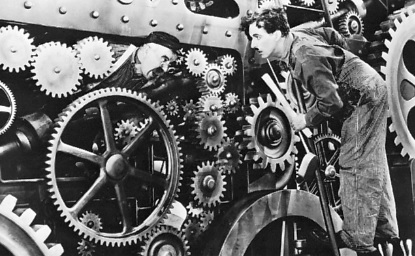
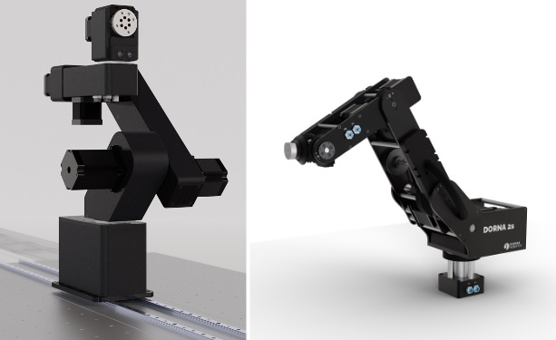

# **1. Introduction To Robotics**

## **Overview**
This chapter aims to comprehensively review the industry's current state of robotic applications. We will explore the various types of robots and their use cases in different scenarios. This review will help us better understand the goals and prospects of this course, which aims to introduce us to the world of industrial robots.

Additionally, we will become familiar with the key components of industrial robots and examine a general-purpose robotic arm, such as the Dorna robot, which we will use as a training tool throughout this course. Understanding its basic features and safety concerns is crucial before we begin using it.

---
## **History of Industrial Robotics**
Industrial robotics is a sub-field of robotics that focuses on the automation of manufacturing processes. it has a rich history that spans several decades. This introduction aims to provide a comprehensive overview of the key developments and milestones in the history of industrial robotics.

### *Early Beginnings*
The concept of automata dates back to ancient civilizations, with early ideas appearing in Greek mythology. The 19th century saw advancements in automation with the invention of mechanical looms and other machinery during the Industrial Revolution.
The first automated machines can be dated back to the early 20th Century. The early 20th century witnessed the development of more sophisticated automated machines. For instance, the assembly line, introduced by Henry Ford in 1913, revolutionized manufacturing but was still reliant on human labor.

|  | 
|:--:| 
| *Figure 1.1: From Charlie Chaplin’s “Modern Time” (1936) showing how the people in the early 20th century looked at the advancement of industrial automation.* |

### *The Birth of Modern Industrial Robotics*
The 20th century saw significant advancements in many fields of science and technology. New technologies related to mechanical and electrical engineering, such as electronics, computer science, cybernetics, and electric motors, greatly contributed to the progress of robotics, industrial robotics, and automation.
In 1954, George Devol filed a patent for the first programmable robot, later known as Unimate. Unimate became the first industrial robot and was installed at a General Motors plant, marking the first commercial use of an industrial robot. This robot performed tasks such as welding and material handling.

### *Growth and Development*
The 1970s saw significant advancements with companies like Fanuc, KUKA, and ABB entering the market, each contributing to the development of more versatile and efficient robots.
The introduction of microprocessors in the 1980s allowed for greater control and programmability, leading to more complex and capable robots.
Robotic arms became a staple in manufacturing for tasks requiring precision, such as welding, painting, and assembly. Innovations in sensors and control systems enhanced their accuracy and reliability.

### *Modern Advancements*
The integration of artificial intelligence (AI) and machine learning in the 1990s and 2000s led to smarter robots capable of learning and adapting to new tasks.
Collaborative robots, or cobots, were introduced, designed to work alongside humans safely and efficiently.
Modern industrial robots are characterized by their connectivity, flexibility, and efficiency. Industry 4.0, the current trend of automation and data exchange in manufacturing, incorporates the Internet of Things (IoT), cloud computing, and cyber-physical systems.
Advances in robotics continue to be driven by improvements in AI, machine vision, and sensor technologies, enabling robots to handle more complex and varied tasks.

### *Future Prospects*
Future advancements may include greater autonomy, enhanced human-robot collaboration, and the use of robots in new industries such as healthcare and service sectors. The ongoing development of quantum computing and advanced AI is expected to further revolutionize the capabilities of industrial robots.

---

## **Types of Robots**
Industrial robots are categorized based on their mechanical structure, movement capabilities, and specific applications. Each type is designed to perform a range of tasks with varying degrees of flexibility, precision, and efficiency. Next up we will overview some of the main types of industrial robots used in manufacturing and other industries.

### *Articulated Robots*
Articulated robots have rotary joints that can range from two to ten or more interacting axes. These robots are the most commonly used in industrial applications due to their high flexibility and dexterity, enabled by their numerous rotary axes. They can perform complex movements with a wide range of motion.
Some common applications of articulated robots in industry include complex tasks such as welding, material handling, parts assembly, and painting. These robots are considered the most versatile, with the broadest range of use cases.
|  | 
|:--:| 
| *An articulated robot at work* |

### *SCARA Robots*
SCARA (Selective Compliance Articulated Robot Arm) robots are characterized by their parallel-axis joint layout, which allows for movement in the X-Y plane and vertical (Z) movements. While their range of motion is more limited compared to articulated robots, SCARA robots excel in high-speed and precise lateral movements, making them ideal for tasks requiring horizontal assembly.
SCARA robots are commonly used in industries for tasks such as picking and placing objects, where only straight up-down and horizontal movements are needed. They are excellent for precise assembly operations as well as packaging and sorting tasks.
|  | 
|:--:| 
| *An example of a SCARA robot from EPSON company, with its distinctive parallel axes.* |

### *Cartesian Robots (Gantry Robots)*
Cartesian robots, also known as linear robots, operate on three linear axes (X, Y, and Z) and move in straight lines along these axes. They benefit from their simple design, high precision, and repeatability of motion. These robots are usually very easy to program and use, performing exceptionally well in tasks that primarily require non-rotating movements.
Cartesian robots are commonly used in manufacturing devices such as CNC machinery and 3D printing devices. They are also well-suited for assembly and material handling tasks.
|  | 
|:--:| 
| *A simple design for a Cartesian robot* |

### *Delta Robots (Parallel Robots)*
Delta robots have a unique spider-like design with three arms connected to universal joints at the base. They are known for their high-speed and high-precision operations.
These robots excel at high-speed pick-and-place tasks, they are lightweight and efficient. Because of this, they are limited to specific tasks requiring precision, such as high-speed sorting and packaging and the assembly of small parts.

### *Cylindrical Robots*
Cylindrical robots have a rotary base and a prismatic (linear) joint configuration that moves in a cylindrical coordinate system. Their combination of linear and rotary motion makes them suitable for tasks within a cylindrical area and with moderate flexibility and reach.
They are also used for tasks such as machine tending, material handling, and spot welding

### *Polar Robots (Spherical Robots)*
Polar robots have a central pivot arm with rotational and linear joints, allowing them to operate within a spherical range of motion. These robots have wide reach and versatile movement and they are suitable for tasks requiring large operational areas.
Some of their common Applications are material handling, machine loading and unloading and also welding.
|  | 
|:--:| 
| *Schematic design of the polar (left) and cylindrical (right) robots. The degrees of freedom are shown here, arcs are rotatory, and straight arrows are translational degrees of freedom* |

### *Collaborative Robots (Cobots)*
Cobots, or collaborative robots, are designed to work alongside humans in a shared workspace. They are equipped with advanced sensors and safety features to ensure safe interaction with human operators. These types of robots are commonly easy to program and integrate, and they are flexible and adaptable to various tasks.
Cobots are typically not heavy or large in size due to safety concerns, and because of this, they are not capable of handling heavy objects. Their usual applications include assembly, quality inspection, machine tending, and packaging.

<h3 style="margin-top: 0;">Lab Exercise 1</h3>
The goal of this exercise is to apply what you’ve learned about different kinds of industrial robotics to specify the type, motion range, abilities, and possible use cases of the Dorna robot present in your lab. Understanding these basic features about the robot you’re going to use will help you interact with it more effectively.
Your instructors will turn off the motors, allowing you to move the robot’s joints by hand. Count the number of motors and axes, and discuss how many of the axes are parallel to each other. Test the motion range of each joint.
Using a measuring tool, measure the robot’s motion range by determining the distance between the farthest and nearest points the robot’s end effector can reach.
Refer to the robot’s user manual to note its maximum speed and possible pick-up weight. Discuss which family types of robots the Dorna TA may belong to and the tasks at which it may excel.
Imagine this robot performing different jobs, and imagine some of the tasks you’ve learned about in this chapter done with the help of this robot. Consider how you would position the robot if you wanted to program it for tasks such as pick and place, packaging, and welding.

---

## **Key Components of Robotic Systems**
Industrial robots have revolutionized manufacturing processes, enhancing efficiency, precision, and productivity. These sophisticated machines are designed to perform repetitive and complex tasks with high accuracy, often in environments that are hazardous or unsuitable for human workers. Here are the fundamental components that commonly make up an industrial robotic system.

### *Manipulator (Robotic Arm)*
The manipulator, commonly referred to as the robotic arm, is the most visible part of an industrial robot. It mimics the human arm and consists of segments connected by joints, which provide movement in various axes. The manipulator's primary function is to position the end effector (tool) in the desired location within the workspace. Depending on the complexity of the task, manipulators can have anywhere from three to six degrees of freedom.

<h3 style="margin-top: 0;">Exercise 1</h3>
Exercise 1.1
Below is a picture of the robot model Dorna TA and beside that is a picture of an older version of Dorna 2s. Judging by the picture of this different version of the robot’s manipulator, count its number of degrees of freedom, and compare its possible ranges of motions with Dorna TA.

|  | 
|:--:| 
| *Left Dorna TA and right Dorna 2s manipulators side-by-side comparison* |

### *End Effector*
The end effector is the device attached to the end of the robotic arm, designed to interact with the environment. It can be a gripper, welding torch, painting nozzle, or any other tool necessary for the task at hand. The selection of the end effector is crucial as it directly influences the robot's ability to perform specific operations. Advanced end effectors can be equipped with sensors to provide feedback and improve precision.

|  | 
|:--:| 
| * Different end effectors attached to Dorna TA for different tasks, from left to right: a camera for video/Image capture, a pneumatic gripper with specially made jaws for gripping onto a specific object, and a suction cup for pick-and-place a relatively lightweight object with a flat surface for the suction cup to hold on to* |

### *Actuators*
Actuators are the components responsible for converting energy into mechanical movement. They are essentially the muscles of the robot, driving the motion of the manipulator and end effector. Common types of actuators include electric motors, hydraulic cylinders, and pneumatic cylinders. Each type has its advantages: electric motors are precise and efficient, hydraulic actuators provide high power, and pneumatic actuators are lightweight and fast.
Pneumatic grippers and suction cups are two kinds of end effectors that we will use in this course and many real scenarios for robot-environment interactions. 

Pneumatic grippers use compressed air to operate. They consist of a pair of jaws or fingers that open and close to grasp and release objects. A pneumatic actuator, typically a cylinder, converts compressed air into mechanical motion to open and close the gripper. The robotic system needs to control the flow of compressed air to the gripper. This is achieved through solenoid valves controlled by the robot’s controller.
The pneumatic gripper is physically attached to the end of the robotic arm. Air hoses run from the gripper to the air supply and solenoid valves, which are usually mounted nearby.

The robot's controller sends electrical signals to the solenoid valves, regulating the air pressure to the pneumatic actuator. This control ensures precise operation of the gripper for picking and placing tasks.
Suction cups, or vacuum grippers, use vacuum pressure to lift and hold objects. A vacuum generator (pump) creates the necessary suction pressure.  The robot's controller manages the vacuum generator and valves that control the suction and release actions. The robot's controller sends signals to operate the vacuum generator and control valves. These signals create or release the vacuum, enabling the suction cup to pick up or release objects as required.
You’ll learn to control and program all sorts of actuators throughout this course.

### *Sensors*
Sensors are critical for providing the robot with information about its environment and its own state. They enable the robot to detect obstacles, measure distances, and perform quality control tasks. Key types of sensors used in industrial robots include:

- **Proximity Sensors**: Detect the presence of objects.
- **Vision Systems**: Use cameras and image processing to recognize objects and guide tasks.
- **Force/Torque Sensors**: Measure the forces exerted on the end effector to ensure delicate handling or precise assembly.
- **Encoders**: Provide feedback on the position and speed of the robotic joints.
  
|  | 
|:--:| 
| *Dorna TA’s camera input* |

In this course, you will learn to work with a vision system and receive inputs from the robot's input system and motor's encoders. You will also learn how to set up custom input systems, such as proximity sensors, and also to incorporate the data acquired into the robot’s program.

### *Controller*
The controller acts as the robot's brain, processing inputs from sensors and issuing commands to actuators. It runs the robot's software and algorithms, ensuring that tasks are performed correctly and efficiently. 
In the following chapters, you’ll learn the technical knowledge needed to interact with the controller, obtain data from it, and program it to perform your desired tasks.

### *Power Supply*
Industrial robots require a reliable power supply to operate. Depending on the type of actuators and the tasks performed, the power supply can range from electrical power for motors to hydraulic power for cylinders. Ensuring a consistent and sufficient power supply is essential for the uninterrupted operation of the robotic system.

### *Software*
The software is the backbone of the robotic system, controlling everything from motion planning to task execution. It includes the operating system, application-specific programs, and sometimes simulation tools for testing and optimization. Modern industrial robots often use open-source software platforms, enabling customization and integration with other systems in the manufacturing environment.
Accompanying the Dorna robotic arm is a robotic interface software and a programming API, both of which are open-source on GitHub. The graphical user interface (GUI), called Dorna Lab, lets you view and interact with a 3D model of the Dorna robot, connect to your robot, send commands, plan complex motions, and write programs using both traditional code and the easy-to-use graphical programming tool, Blockly.
The API, on the other hand, is a lower-level Python library that helps you programmatically interact with the robot, send commands, and receive and handle data from encoders and sensors. Both of these systems are crucial for our journey throughout this course.

---

## **Safety**

Industrial robotics have revolutionized manufacturing by improving efficiency, precision, and flexibility. However, the integration of these advanced machines into workplaces also brings significant safety considerations. Ensuring the safety of personnel working alongside robots is important, requiring a comprehensive approach that encompasses both technology and operational protocols.

Here we will review the potential hazards that may harm the robot and/or the person using it, as well as anyone present near the robot. We will discuss the safety features and tools that come with the robot, which you should be familiar with before starting to interact with it to prevent any harm. Additionally, we will cover some precautions that people need to take when working with the Dorna robot and any industrial robots in general.

### *Possible Safety Issues*
The robot body weighs less than 10 kg; however, it can move quickly and cause injuries, especially when certain end-effectors are attached to its flange (e.g., a sharp tool or a laser). The robot also has pinch points where its joints can squeeze a finger. Conducting a risk assessment of the complete robot cell, including the Dorna robot, its end-effector, and all adjacent equipment, is very important. Some of the risks to you and those around you that you need to consider are:
- Penetration of skin by sharp edges and points on the robot belts, joints, or tool/end effector.
- Bruising due to contact with the robot.
- Strokes between a heavy payload and a hard surface.
- Consequences of loose bolts that hold the robot arm or tool/end effector.
- Items falling out of the tool/end effector, e.g., due to a poor grip or power interruption.
- Mistakes due to confusing different emergency stop buttons for different machines.
- Mistakes due to unauthorized changes to the safety configuration parameters.

On the other hand, careless use of the robot may harm the robot, controller, connected tools, and environment, causing damage to the assets. Some of these risky actions will be presented to you in this chapter. By learning and keeping the safety precautions in mind, the risks will be minimized.

### *Dorna TA Safety Features*
#### *Brakes*
The Dorna TA has a braking mechanism that activates when power is abruptly disconnected from the robot, preventing crashes and damage to the robot or workpiece.
When power is cut from the robot’s motors, they are prone to rotate under any external force or the current momentum the robot has, totally out of control, since the motors lack a mechanical brake system. As the robot is always under the influence of its own weight, if the motors are free to rotate, it could fall towards the ground, causing unpredictable harm.
The brakes are designed to slow down the free fall of the robot, but remember that they are not intended for total position lock and are only present as a safety feature.

#### *Emergency Stop*
You can configure and set up an emergency stop push-button for the robot to stop the robot immediately and prevent it from executing any further commands.The emergency button connects to the robot's digital inputs (you’ll learn about these inputs in the upcoming chapters) and sends the robot into an alarm mode when the associated input pin gets triggered.

You can also use the "Halt" button in Dorna Lab or the "Halt" command in the API to immediately stop all the robot's movements, which can be useful in many risky scenarios. However, this feature is not as reliable as the "Emergency Button," which should be properly set up for each use case scenario.

|  | 
|:--:| 
| *The “red” halt button at the top-right corner of the Dorna Lab* |

|  | 
|:--:| 
| *Configuring the emergency button (in the Dorna Lab settings). This involves reserving one of the robot’s input pins and a specific value for that pin. The controller will abruptly halt the robot's motions when the value of the input pin matches the given value. We will learn about the input pins in the upcoming chapters* |

#### *Collision Detection Safety Function*

Collision detection is a critical safety feature in industrial robotics, designed to prevent accidents and damage by detecting and responding to unexpected contacts between the robot and its environment. This technology uses sensors, such as force-torque sensors and accelerometers, and in the case of the Dorna robotic arm, it uses the motor’s encoders, to monitor the forces and movements experienced by the robot. When the system detects an abnormal force or deviation, it can trigger an immediate response, such as halting the robot's motion or retracting its arm to avoid or minimize the impact.

By integrating collision detection, industrial robots like the Dorna robot can operate more safely in environments where humans are present. This feature not only protects workers from potential injuries but also safeguards the robot and its tooling from damage. Collision detection enhances the overall reliability and safety of robotic systems, allowing for closer human-robot collaboration and reducing the need for extensive physical barriers. As a result, workplaces can achieve higher efficiency and flexibility while maintaining stringent safety standards.

Dorna robots are equipped with special safety functions purposely designed to enable collaborative operation, where the robot system operates without fences and/or with a human. Collaborative operation is only intended for non-hazardous applications, where the complete application, including tool/end effector, workpiece, obstacles, and other machines, is without any significant hazards according to the risk assessment of the specific application.

When the robot motors are enabled, the robot's motion planner and closed-loop feedback system continuously adjust the robot's orientation. The safety function compares the actual and planned positions of the robot, activating an alarm and stopping the robot immediately if a certain amount of error (error threshold) persists for a specified duration (error duration). This helps the robot to detect collisions with an external object.

The sensitivity of the safety function can be configured based on your application and by adjusting the error threshold and the error duration parameter. The two parameters can be set via the PID commands or Dorna Lab.

Below you see the effects caused by increasing or decreasing the error threshold/duration:

| ⬆️ Increasing error threshold/duration      | ⬇️ Decreasing error threshold/duration     |
|--------------|--------------|
| The robot becomes less sensitive to external forces |The robot becomes more sensitive to external forces and can go into an alarm mode more easily  |
| More risk assessments are required as the robot is less sensitive to detect collisions| This mode is recommended when operating the robot around a human or sensitive object  | 
| The robot can operate at a higher speed or larger payload before entering an alarm | Now, you must operate the robot at a lower speed or payload |
|The robot can collide with an object without entering an alarm mode |  | 

### *Safety Precautions*
Here, we will review some important precautions to keep in mind while working with robots (especially the Dorna TA). These precautions should concern you before turning the robot's power on, while the robot's power is on and it's operational, and when the work is completed and you are turning the power off.

#### *Before Turning the Robot's Power On*
- Ensure all connections are secure and correctly plugged in
    - Always use the cables provided with the robot.
    - Make sure that the robot cables are straightened and not twisted.
    - Make sure the connections are secure using the screws on the robot cables.
- In case an emergency stop button is installed, verify that it is accessible and functional.
- Check that the work area is clear of obstacles or hazards.
- Inspect the robot arm and its controller box for damages. If either appears damaged, do not use them, and contact the instructors immediately.
- Do not modify or disassemble the robot arm or the controller.
- Do not use or store the robot and its controller in a humid environment.
- Check the robot’s Installation to the table/ground is proper, If the robot tips and falls from a height, it may cause an injury and certainly get damaged.

#### *While the Robot's Power is On and It's Working*
- Always be alert and attentive to the robot's movements.
- Avoid reaching into the robot's workspace while it's in operation.
- Monitor the robot's status and immediately halt operations if any abnormalities occur.
- You should keep in mind that improper use of the robot may cause the motors to lose power, for example, under the circumstances listed below the motors will fail:
  - Motions with high speed, acceleration, or jerk.
  - Applying too much torque on the motors. This may happen whenever asking the robot to pick an overweight object or to move while an obstacle is blocking its way.
  - Turning the controller off or disconnecting cables while it’s working.
  - When the robot hits an object.  

#### *When the Work is Done*
- Safely remove any tools or end-effectors from the robot.
- Ensure the robot is in a safe position and not blocking walkways.
- Use the designated shutdown procedure to power off the robot safely.

<h3 style="margin-top: 0;">Lab Exercise 2</h3>
Turning on the robot for the first time: In this exercise, you should follow the steps below to turn on the robot for the first time. Keeping safety cautions you learned about in mind.

  <ul>
    <li>Check the installation. Is it stable enough?</li>
    <li>Place the robot in a proper orientation for the beginning.</li>
    <li>Connect the Controller to the power supply that is prepared by the instructor.</li>
    <li>Attach one side of the robot DB-25 and DB-9 cable to the back of the robot base and the other side to the back of the controller. Ensure the connections are secure using the screws available on the DB shells.</li>
    <li>Check if the environment is empty enough, there should not be any obstacle in the vicinity of the robot.</li>
  </ul>

  Now try powering the robot on.

