# **3. Robot Programming Tools**

## **Basic Algorithmic Concepts**

Programming is the language that brings robotic systems to life, enabling them to perform complex tasks. In robotics, programming acts as the bridge between the mechanical components of a robot and the desired behaviors that make it useful in real-world applications. It provides the logic and decision-making capabilities necessary for a robot to interact with its environment, respond to changes, and execute tasks autonomously. 

You don’t need to master complex algorithms, and data structures, or write highly efficient code to program a robotic system. In fact, you don’t even need to be a professional programmer. Tools like Blockly offer a user-friendly graphical interface that allows you to create simple algorithmic structures for performing industrial tasks. Python, with its intuitive syntax and readability, provides a powerful yet accessible way to program robots, bridging the gap between beginners and professionals. Its resemblance to natural language makes it easy to learn and use, while its versatility and extensive libraries make it suitable for a wide range of robotic applications, from basic automation to advanced AI integration.


Programming an industrial robotic system requires understanding several fundamental programming concepts. These concepts/structures are essential for automating tasks, coordinating movements, and managing the robot's interactions with its environment. Here are some key concepts that are crucial for programming industrial robots:
    
### *Sequential Operations*
Sequential operations are step-by-step Instructions, is to program the robot to perform a series of actions in a specific order (e.g., move to a position → pick up an object → move to another position → place the object). This is the most straightforward, and simple structure possible in robot programming, without any logic and complexity, everything is predetermined and pre-decided. 


| 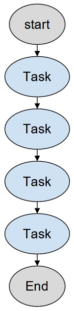 | 
|:--:| 
| *Sequential operations, simple and straightforward* |

### *Conditional Statements*
Conditionals or If/Else statements are fundamental control flow structures in programming that allow a robot (or any program) to make decisions based on certain conditions (e.g., if an object is detected, pick it up; else, continue scanning). 
| 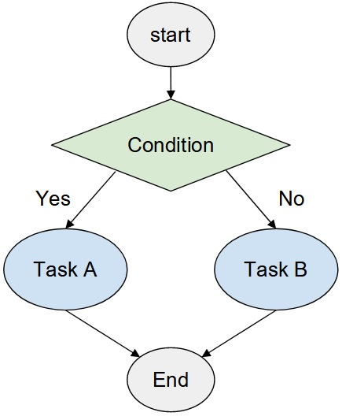 | 
|:--:| 
| *Conditional expressions, let the robot decide between different branches based on the inputs* |

### *Loops*
Loops let us repeat processes, it’s useful for all sorts of repetitive tasks, such as inspecting a series of products on a conveyor belt, and the robot performs the same set of actions for each item.

There are two commonly used kinds of loops:
- **For Loops**: Repeating a set of instructions a specific number of times (e.g., inspect 10 items on a conveyor belt).
- **While Loops**: Repeating a set of instructions as long as a condition is met (e.g., continue assembly operations while the assembly line is running).

| 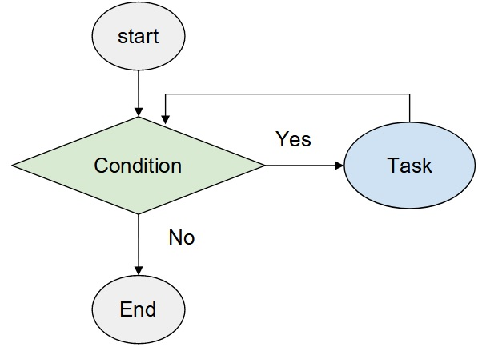 | 
|:--:| 
| *Loops lets us repeat an operation until it's necessary* |


### *Variables*
Variables are fundamental components in programming. They are used to store data that can be referenced and manipulated by the program. Understanding how to use variables effectively is crucial for developing robotic applications.
Variables are symbolic names given to data that can hold different values. They act as placeholders for data that your program can use and change as it runs. Variables can store various types of data, such as numbers, strings, arrays, objects, and more.

- **Scalar Variables**: This type of variable, holds single values such as integers, floating-point numbers, or strings.
- **Array Variables**: This type of variable, stores multiple values in an indexed collection, which can be useful for handling lists of data.
- **Object Variables**:  This type of variable, can store complex data structures, including objects with multiple properties and methods, useful for representing more complex entities.
- 
### *Timing*

Handling timing and wait states in robotic systems is a crucial aspect of programming, ensuring precise synchronization and coordination of tasks. It's important to control time delays between operations and manage the waiting times required for receiving inputs. For instance, consider a scenario where you need to scan barcodes of items in a box using a scanner toolhead attached to the robot. First, you command the robot to move to the correct position for scanning. Then, you instruct the scanner to initiate the scan, but this process typically takes a few seconds to complete. Without implementing appropriate wait times, if the robot moves away too quickly, the barcode scan may not finish successfully, leading to incomplete or inaccurate readings. Proper timing control ensures that each task is completed before moving on to the next, maintaining the system's efficiency and reliability.

---
## **Dorna Command System**
Before learning to program the Dorna TA robotic system, we will learn the command system that is the main way of interacting with this robot. We talked about some simple “motion” commands in the last chapter. Here we will explore the whole variety of commands and their features and abilities.

The command system is a messaging system, it works in both ways, the user sends messages to the robot, and the robot also responds back and it also notifies users about the changes in its state and inputs. The terminology we use here is as follows:
follows:
- **Command**: Refers to a data message sent from the user to the robot.
- **Message**: Refers to the data message sent from the robot to the user.
- 
|  | 
|:--:| 
| *Dorna lab's script panel* |

In this section, we’ll use the Dorna Lab “script” panel to send commands and read messages. In the figure above:
- **1. Script**: Where you write the commands. The commands are separated in lines.
- **2. Log**: Where you can read the messages from the robot server.
- **3. The Play button**: Click on it to commit all your written commands for execution.
- **4. File options**: Click on it and use the options appearing to save/load the commands.

**Note**: In the context of Dornal Lab, “Save” and “Loading” means saving data onto and loading data from the robot’s server. While “Downloading” and “Uploading” means saving and loading on the user’s computer.

Each command/message is a self-sufficient line with JSON format like below:

```JSON
{"key-1":value-1, "key-2":value-2, ... , "key-n":value-n}
```

Here the string ```"key-i"`` is the name of the i-th parameter and ```value-i``` is the value assigned to that parameter. One should choose the desired keys needed for the command their sending and should assign proper values to the keys.

Important notes:
- The order in which key and value pairs are presented in each package is not important, but each key should only appear once in a command.
- Keys are always a string in double quotation (“”).
- Values assigned to each key can be number, string, or binary (instead of true/false we use 1/0).
- The keys and values (in string format) are case-sensitive. All strings should be in lower letters. 

The robot messages also have the same format as the commands, and usually, the same keys are shared between commands and messages. The messages are the way for the robot to report its current state. Here are different possible messages that we may receive:

- **Motion Messages**: These messages are emitted rapidly (around 100 every second) and contain updates on the robot joint value, its Cartesian position, and the velocity and acceleration. These messages do not appear in the Dorna Lab logs and are handled internally.

- **Input Values**: These messages are sent whenever an input value has changed, to notify the user about the changes.

- **Command Status**: Every command we send to the robot has a status that the robot will update us about.

- **Command Responses**: Some of the commands ask the robot for information, these messages are the responses to those commands.

- **Alarm mode**: It is the message for when the robot enters an alarm mode.

Now let’s get to the commands. The necessary key that you need to send for every command is the ```"cmd"``` key. This key’s value indicates the type or purpose of the command we’re sending, e.g. ```“jmove”``` for joint motion, or ```“halt”``` for motion halt, and so on. 

When you commit a command to the robot, it cannot be executed instantaneously; instead, it is added to a queue and waits for its turn. Commands are processed in the order they are added, with new commands joining the end of the queue. However, there isn't just one queue for all commands. In fact, there are two: a standard queue and a high-priority queue. The high-priority queue is reserved for commands that need immediate execution, bypassing the standard queue to ensure critical tasks are handled without delay. This dual-queue system allows the robot to prioritize urgent commands while maintaining a smooth workflow for routine operations.

|  | 
|:--:| 
| *Analogy for dual-queue system* |

This whole situation is like a passport check line in the airport, there is a normal queue for normal people, and there is a VIP line for important people. Until the VIP line is not empty, no one from the normal queue gets their passport checked. When there are no tasks remaining in the high-priority queue then the tasks in the normal-priority queue get done. There are many use cases for high-priority commands. For example, emergency halt commands or sudden and fast input value reads. 

To choose the queue you want your command to be submitted to use the ‍‍‍‍```”queue”``` key, give it a 0 value for the normal queue (0 is the default value for this key) and 1 for the high-priority queue.

An optional key that you can set in any command is the ```"id"``` command which lets you track your command status later on. You should assign a unique number (a positive integer) to your command as its id value so that it would be trackable. When the ```"id"``` is assigned, the robot will send you back messages to update you on the status of your command.

For example, sending an alarm command like:

```JSON
{"cmd":"alarm", "id":12}
 ```
This will result in a series of messages like the below:
```JSON
{"id":12, "stat":0}
{"id":12, "stat":1}
{"cmd":"alarm", "id":12, "alarm":0}
{"id":12, "stat":2}
```
As you can see, the status messages contain the ```"id"``` of your command, and also a ```"stat"``` key which can have different values based on the status of the command. These values are explained in the figure below.

|  | 
|:--:| 
| *Analogy for dual-queue system* |

The controller will send back a negative ```"stat"```  if the execution of the command has gone wrong. The negative value of the ```"stat"``` is called the error code. Each command has different error codes that you should look up in the robot’s user manual in case an error occurs. For example, an out-of-range ```"lmove"``` command will give you the error code -100. 

Here we will review some of the important commands you need to know to work with the Dorna TA.

<table>
<tr>
   <td><b>Command</b></td> <td><b>Description</b></td><td><b>Keys</b></td>
</tr>
<tr>
<td>
    
```“jmove”```,
```“lmove”```, 
```“cmove”```

</td>
<td>
    Performing motion commands as it was discussed in the previous chapter
</td>
<td>
    
```(“j0”,...,“j5”)``` or ```(“x”,...,”c”)```: specify the end point of the motion

```“rel”``` : for relative motion assign 1 and for absolute motion 0.

```“vel”```,```“accel”```, and ```“jerk”``` are the dynamic parameters.

```“cont”``` should be 1 for the continuous motion feature.

```“corner”```, for the continuous motion you should give a non-zero value for the corner radius

For the ```“cmove”``` you should also provide the position of the middle point using the keys:
```(“mj0”,...,“mj5”)``` or ```(“mx”,...,”mc”)```

```“turn”``` key also can be used for ```cmove```, specifying the number of full turns around the circle. 

</td>
</tr>
<tr>
<td>

```“halt”```
    
</td>

<td>

Stops all robot motion.
    
</td>

<td>

```“accel”``` specifies the robot’s stopping acceleration.

</td>

<tr>
<td>

```“alarm”```
    
</td>

<td>


After the robot collides with something, it goes into alarm mode (we talked about it in the safety section of chapter 1)  and does not move again until the alarm mode is cleared. 

</td>

<td>
    
```“alarm”```: set it to 0 in order to clear the alarm mode.

</td>
</tr>

<tr>
<td>
    
```“sleep”```

</td>
<td>

The robot sleeps for the number of seconds specified in this command. It can be used to create a delay between the execution of motion commands or other commands in the normal priority queue as it executes in the normal priority queue in the same order that it was received by the controller.

</td>
<td>
    
```“time”```: this specifies the duration of wait measured in the unit of seconds. 

</td>

</tr>

<tr>
<td>

```“input”```

</td>
<td>
    
This command will ask for an immediate report of the input values. The response to this command gives the value of all the inputs: ```"in0"```,… , ```"in15”```

</td>
<td></td>
</tr>
<tr>
<td>

```“probe”```

</td>
<td>

Match the input values with the pattern that the user specifies. Whenever such a pattern appears at the input pins, the robot will send a response which is the joint value of the robot at the time that the matching happens. This command could be useful for homing an actuator with a sensor connected to an input pin. Note that the controller will only send the response after the first match happens and consequent matches won't be responded to. This command by default will be submitted to the high-priority.

</td>
<td>

```"in0"```, ... , ```"in15”```: specify your desired pattern for all the inputs, if an input is missing, then it’s value won’t impact the matching.

</td>
</tr>

<tr>
<td>

```“output”```

</td>
<td>

Set or get the values of the output pins. After the robot receives this command, it will set the output values and in response will return the value of all output pins. The default queue for this command is the high-priority queue. 

</td>
<td>

```"out0"```, ```"out1"```, ```"out2"```, ... , ```"out15"```: assign values to any of these keys in order to set their values.

</td>
</tr>

<tr>
<td>
    
```“joint”```

</td>
<td>

This command will set the joint values. This command is particularly useful for the homing process. The return value from the controller will be the value of all the joint values of the robot after the new values are applied. This command can be used to read the current value of joints if it is used with no assigned joint input.

Dorna TA uses encoders on its joints that keep track of the joint positions even when its power is off. Therefore no homing is required for the first 6 axes of the robot upon starting the robot.

</td>
<td>

Use any of the ```"j0"```, ```"j1"```, ... , ```"j7"```, but one at a time. 
    
</td>
</tr>
<tr>
<td>

```“motor”```

</td>
<td>

This command is used to turn the motors on or off. The user can turn motors off to either save power while the robot is not operational or to place the robot in a predetermined location as a homing process or hand train the robot by moving it to different locations manually and saving the positions of those points.

</td>
<td>

```"motor"```: specifies the motors' state, 0 for off, and 1 for on.

</td>
</tr>
<tr>
<td>

```“tool”```

</td>
<td>

With this command, you can set or get the tool matrix. This is used for forward and inverse kinematics calculations inside the robot. 

</td>
<td>

```“tx”```, ```”ty”```, ```”tz”```, ```”ta”```, ```”tb”```, ```”tc”```
These are the XYZ translation part of the TCP matrix and 3 axis-angle rotation angles a,b, and c.

</td>
</tr>

<tr>
<td>

```“version”```

</td>
<td>

Sending this command returns the version of the firmware.


</td>
<td></td>
</tr>
</table>

---
## **Blockly**

Blockly is a visual programming language developed by Google that allows users to create programs by assembling blocks that represent code concepts. These blocks can be dragged, dropped, and snapped together like puzzle pieces, providing a more intuitive and accessible way to write code, especially for beginners and those unfamiliar with traditional text-based programming languages. Blockly also makes prototyping and testing easy and fast.

One of Blockly's key strengths is its ability to make programming more approachable by abstracting complex code into simple, understandable blocks. This visual approach helps users, particularly students and young learners, to grasp fundamental programming concepts such as loops, conditionals, and variables without getting bogged down by syntax errors. Blockly is a powerful tool for teaching and learning programming concepts.

Dorna robotic has integrated Blockly in the Dorna lab as one of the main methods for programming the robot. It works on top of Dorna’s Python API, your blocks of code in Blockly first get translated into Python code, then the controller runs the Python codes. You’ll learn to write the Python code needed to interact with a Dorna robot in the next subsection.

### *Getting Started With Blockly*
Start by selecting the Blockly tab on the tab selection panel,

  

 This takes us to the Blockly programming environment:

 | 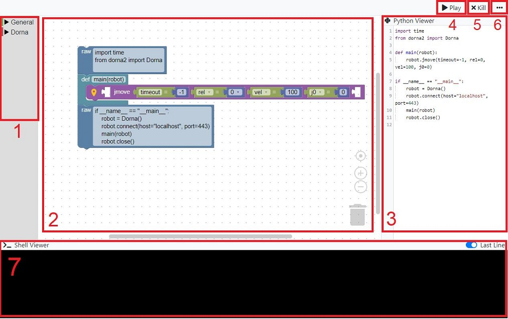 | 
|:--:| 
| *The Blockly programming environment in Dorna lab* |

Let’s break down all the parts in the figure above:

1. The toolbox, contains all the blocks needed for programming. It contains two major classes of blocks. “General” contains all the necessary general blocks for creating a basic program, like if/else statements, for loops, math/logic operators, and so on. The Dorna section on the other hand contains all the Dorna-related blocks. All the blocks needed to interact with the robot.
   
2. The block editor, where you can construct and edit your code by moving around the blocks and attaching them. When you open up the Dorna lab, there is a default arrangement prepared in this section. There is all the initialization needed to start writing simple programs right away.

   
3. The Python viewer: where you can observe the translated code, in real-time.
 
4. The Play button: Clicking this button will send the code generated to the robot, and the program will get start running.

5. The Kill button: If there is an ongoing program running in the controller, this button will kill it right away and all its procedures will stop right away. But if that program has sent some motion commands and those commands are still running, they won't get halted (Use the Halt button if needed)

6. Additional Options: Clicking this button will open up additional options for you, where let’s use save open, download, upload, and clear the Blockly blocks you’ve generated.

 |  | 
|:--:| 
| *Additional options for Blockly* |

7. The Shell viewer, is where you can see the log from the codes you’ve submitted to be run in the controller.

Interact with the blocks editor using the mouse buttons, move around the view by clicking and dragging the empty space on the editor, and zoom in/out using the mouse wheel.

The blocks are connected to each other in A hierarchical order, from top to button and from left to right. Moving a block that is up in the hierarchy, moves all the lower-level blocks connected to it, but moving a lower block causes it to disconnect from the higher-level blocks.

Right-clicking on the blocks gives you some options:

 |  | 
|:--:| 
| *Additional options for each block* |

Duplicating the blocks can be used for recreating repeating patterns of blocks. Adding comments helps make your code readable. These comments will also appear in the Python code. Collapsing (and later Expanding) the blocks makes the code tidy and clear to read. Disabling a block will also make a block inactive, so it won’t get translated into Python code, and it won't take a role in the execution.

Some useful short keys for a faster interaction with the Blockly editor are as follows:
- ```Ctrl+Z``` to undo, and ```Ctrl+Y``` to redo
- ```Ctrl+C```, ```Ctrl+V```, ```Ctrl+X``` to copy, paste, and cut.
- ```Delete``` to delete blocks.

You can start writing your code by adding more blocks to the editor, start by expanding the toolbox, and drag and drop the blocks into the editor:

 |  | 
|:--:| 
| *Toolbox expanded* |

All the commands are structured in the toolbox in the proper subtrees, and they come with the default ready-to-use values to make life easier. 
Usually in most cases, you won't need to change the default code structure given to you. In this structure, you should only add the blocks to the “main” body of the code in the figure below:

 |  | 
|:--:| 
| *The place where you should add your code blocks following the default structure, This area will get expanded when you drag new blocks to it* |

 |  | 
|:--:| 
| *⚠️ Don’t leave the blocks unconnected in the editor, otherwise they don’t work as you may intend* |

The blocks will run from top to bottom and left to right. You should note that blocks have different kinds of connections:

#### *Top-Bottom Connections*
Each block with a top-bottom connection is a single line of code, or a unit of command or logic in your code or it encapsulates some lines, you should fill the main body with a series of these kinds of commands as can be seen below.
 |  | 
|:--:| 
| *Top-bottom connections* |

#### *Left-Right Connections*
These jigsaw-puzzle-like horizontal connections are always used for adding options to our commands and lines of code. These are also called “input” connections because we can use them to give inputs to the functions.
 | 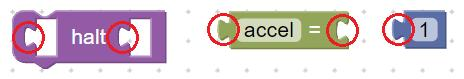 | 
|:--:| 
| *Left-right connection* |

Other than connecting blocks in the editor, you can use the input fields or drop-down lists to give numerical inputs and strings of text and select different options in your blocks options.

### *Simple Algorithmic Structures in Blockly*

#### *Sequential*
Starting from the simplest algorithmic structure, we need to know how to ask the robot to perform a series of commands sequentially, without any decision-making. This can be done by attaching the desired commands sequentially from top to bottom.

|  | 
|:--:| 
| *Sequential structure* |

When the program runs, the command blocks attached in this way will perform their tasks sequentially. 

#### *If/Else Statements*
Next, we need to create an if/else structure and logical operations. Use the “Logic” subtree in the “General” section of the toolbox.  Use the If block to create if/else statements easily.

|  | 
|:--:| 
| *If block* |

This block has top-down connections, meaning that this can also be used sequentially in between other blocks. The input connection in front of the label “if” is where you place the condition that needs to be checked. There is a simple block in this subtree that enables you to create all sorts of possible conditions:

|  | 
|:--:| 
| *Condition block that returns either true or false values* |

Using this simple conditional block, you can compare different objects with each other, For example, two numbers or two strings. Click on the dropdown to see all the options, the condition can be to check if two objects or equal, not equal, or to compare them. For example, the condition in the block below returns true.

|  | 
|:--:| 
| *Example condition that returns true* |

If a block condition is true, then the block inside the “do” section will get executed, and if not those blocks will be omitted and the program will continue from the blocks right after the if block. We can restructure the if block to define an “else” option, this opens a secondary route to run when the condition is false. Click on the ⚙️ button, on the top-left of the if block. A window opens that lets you restructure your if statement, you can add one else route, or multiple else-ifs. Else-if is the same as if but gets another condition as input and checks if that’s true. Here is a schematic example of how this restructured if block can be used:

|  | 
|:--:| 
| *Restructure if block to contain an else-if* |

When you want two conditions to be checked at the same time, you can use the “and/or” block.

|  | 
|:--:| 
| *And/or block gets two conditions and combines them* |

You can also negate a condition using the “not” block.

|  | 
|:--:| 
| *Not block* |

The last block in the Logic subtree is a small if/else statement that is used to decide between two different input values for one input connection (inline condition). For example, the blocks below will pass the larger value between the two values d1 and d2 to the ```“x”``` input of a ```"lmove"``` command.

|  | 
|:--:| 
| *Inline conditions* |

#### *Loops*
The next important subsection in the toolbox is dedicated to loops, “for” loops, and “while” loops.  As we discussed before, loop structure iterates over tasks, and thus can be extremely useful in robotic programming. Let us explore these blocks.

|  | 
|:--:| 
| *Different types of loop blocks* |

These three blocks are “while” and “for” loops; The first one simply iterates the blocks you put in its enclosement, n times (here n=10). The next one is a while loop and instead of counting the number of iterations, it checks a condition you give to it as the input every time, to decide if it should stop the iteration or not. For example, the “while” loop below, will run forever, and the rest of the code will never work.

|  | 
|:--:| 
| *Never-ending for loop* |

The last of the three basic loop blocks is a for loop that gives you a counter variable (we will get to variables in Blockly shorty). The counter variable has a starting value, an end value, and a step size. For example, the code below sends jmove commands to the robot that increases J0, incrementally 5 degrees each time from 45 to 90. Since we’ve got a variable for our counter, we can use it as the input for a function that runs inside the for loop.

|  | 
|:--:| 
| *For loop example* |

There is also the “List iterator” block, a for loop that gets a list of objects from you as input and iterates over all elements of this list. A list or array block can hold as many items as you want. For example, Consider you have a list of J0 values [94, 52, -32], and for each one of these values you want to commit a ```"jmove"``` command to the robot. First, you have to make a list with these items, and then you have to pass that list to the “List iterator”, like below:

| 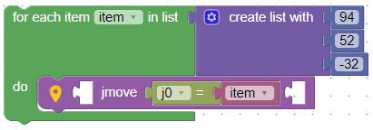 | 
|:--:| 
| *List iterator example* |

One last useful operator is the “Loop Break” block. This block breaks the loop and puts an end to the iteration any time it appears in the loop. This block can also be used as a “Continue” operator (by setting it in the drop-down list). When a continue operator is used, the current iteration will suddenly end, and the loop will continue from the next iteration.

|  | 
|:--:| 
| *Break block example* |

The above example code will increase the value of j0 incrementally but in each iteration, it checks the value of a variable called “x”, if “x” is smaller than 100 the loop will stop iterating. 

You can nest loops inside each other, For example, the loop below iterates over all points on a 2-dimensional grid, and commands a ```"lmove"``` for each one of them:
|  | 
|:--:| 
| *Nested loops* |

Here is the grid of all the points the command above will reach for. Creating these commands without the help of loops, especially nested loops is impossible.

| 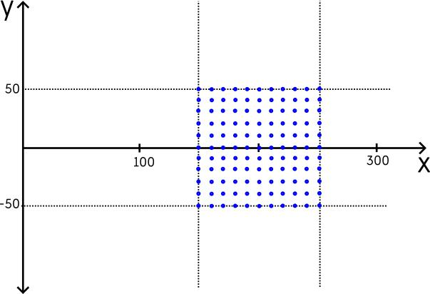 | 
|:--:| 
| *Example grid* |

Keep in mind that using a “Break loop” block inside nested loops will only break the last (lowest) loop. 

<div style="border: 1px solid black; padding: 10px; background-color: #f0f0f0;">
<h3 style="margin-top: 0;">Exercise 1</h3>

In the figure above, generated using the code blocks before it, determines the order in which the robot will visit the points on the grid.

</div>


#### *Variables*
Next up are the variables. Variables let you store values, lists, and all sorts of objects in order to access and use them later. Go to the subtree “Variables” and click on the “Create variable” button to create a new variable. You’ll have to set a unique name for your variable (which can be changed whenever you want).

When you’ve created at least one variable, the “Variables” subtree gives you a block with your variable name on it, so you can use your variable as input for other blocks. There is a “Set variable” block so that you can initialize or change the value of your variable.
|  | 
|:--:| 
| *Setting a variable* |

Keep in mind that you are able to set numbers, strings, lists, conditions, or any sort of objects as your variable’s value, it doesn’t only have to be a number. Here are some examples:

| 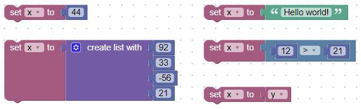 | 
|:--:| 
| *Setting a variable* |

You can set a variable to almost anything that has the proper connection! It can be viewed simply as putting a name on a block so you can use it later without the need for duplication.

Lists are used to store many items of usually the same types in an ordered way. We saw their usefulness for the iterators. There are many options for you to work with lists in the “Lists” subtree. We will review the important ones here. First is the block that let’s you create a list.

|  | 
|:--:| 
| *List creator block* |

Use the setting button ⚙️ on top of these blocks to change the number of items in your list. If you need to fill a list with the same value, use the block below:

|  | 
|:--:| 
| *List creator block* |

This block creates a list of 100 zeros. You can get the number of the items in the list using the “Length of” block and you can check if a list is empty using the “Is empty” block.

|  | 
|:--:| 
| *"Lenght of" and "Is Empty" blocks.* |

The next blocks are all about accessing, getting/setting items in the lists. Let’s see what these blocks do.


 <div style="border: 1px solid black; padding: 10px; ">

  
  
This block is about getting/get&remove/remove an item in the list. The second drop-down lets you choose how to access the list. "#" and "# from end", both take a number from you and count from start/end to find the desired item. There are other options in the second drop-down that are self-explanatory. The picture below shows how "#" and "# from end" count the items in the list.

  
</div>
<div style="border: 1px solid black; padding: 10px; ">

  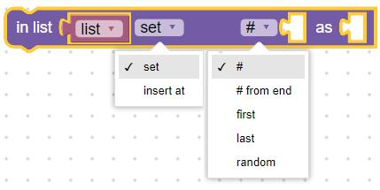

This block helps you set an item in the list, or, it lets you insert a new item, consequently expanding the list. We usually need to insert the new items at the end of the list, to this end we can choose the “last” item from the second drop-down.
</div>

<div style="border: 1px solid black; padding: 10px; ">


This block searches the list, to find the first/last occurrence of the value you are asking of it inside the list. It returns the resulting index of the search. There may be many occurrences of that value in the list, you may choose to get the first or the last occurrence. 
</div>

<div style="border: 1px solid black; padding: 10px; ">


This block simply lets you extract a part of the list by choosing the first and last index of the sub-list you want to extract.

</div>


There are many other useful blocks in the “Main” section of the toolbox. They are usually self-explanatory so we only give a short review here. The “Tag” subtree, contains blocks for writing comments in your code, a text that does nothing and is there just to make your code readable. “Python” subtree, gives you a “raw” block that lets you write explicit Python codes in your Blockly environment. It also gives you access to the “function definition” block that should be explored only if you need to restructure the default Blockly setup.

The “Math” subtree is crucial for robot programming. It contains many blocks to perform all sorts of mathematical operations on the numbers. It also contains blocks that generate “random” numbers for you. 

### *Robot Command Blocks*

When working with Blockly, the robot is considered ready-to-use waiting for your instructions and commands to move around and interact with the world and gather data via the input devices. The Blockly in Dornal Lab has all the commands needed to interact with the robot. You can access these blocks in the “Dorna” section of the toolbox. 

#### *Basic Structure*
All the robot blocks have almost the same structure as below

|  | 
|:--:| 
| *Dorna blocks structure* |

First, there is an input field that is the place to put the variable you intend to store the result of this command or function. This field is of course optional.

The next input fields, also optional, are for adding  key/value sets for the function. For all the blocks there are default needed input blocks attached to them, but if you need to add more, the blocks are expandable, adding a new input, opens up the input connection for another one.

The input ports of the Dorna blocks should be filled with a ```"key" =``` block and a proper value attached to it. This structure gives order to functions with a high number of input fields, for example, a ```jmove``` black can have up to 10 input values, for example: ```j0 = 5```, ```j2 = 10```, ```vel = 20```, and so on. 

In the “Move” subtree you can find blocks that are related to motion commands. These blocks have a record button 📍 on them. Clicking this button fills the input fields of that block with the robot’s current joint and Cartesian values. This can be a lot helpful in the process of hand-training the robot. Turn off the robot’s motor, and bring it to your desired position, create a motion block and click on the record button, and then you have a command that will bring the robot to that desired position. 

#### *Timing*
You’ve now learned to create basic algorithmic structures and to send robot commands in this way. A crucial feature that you should look for in the robotic programming tools, as was discussed before, is time control options, for programming the delays.

To help you easily plan the robot’s wait between commands, all the robot’s commands in Blockly (and the Python API) accept a “Timeout” input. This is how this key help you with timing:

<table>
<tr>
<td>

```timeout<0```
    
</td>
<td>

Send a command and wait for its completion (```stat = 2```(successful) or ```stat < 0```(unsuccessful)) and then return from the function. After a command block with ```timeout < 0```
finishes executing, we are sure that the corresponding command is no longer running (or waiting in line) in the robot.

</td>
</tr>
<tr>
<td>

```timeout=0```
    
</td>
<td>

If we do not want to wait for the execution of a command at all, then we can always set ```timeout = 0```. This causes the program execution to continue without any hesitation.

</td>
</tr>
<tr>
<td>

```timeout>0```
    
</td>
<td>

Send a command and wait for a maximum of ```”timeout”``` seconds for its completion. If the command is completed before the ”timeout” has passed, the program will continue its execution automatically.


</td>
</tr>
    
</table>

If this method for waiting is not sufficient for your goal, there are other waiting options too, for example, you can make the controller “sleep” and thus wait for a specific amount of time without running any commands using the sleep block.

|  | 
|:--:| 
| *💤Sleep block* |

Or you can wait for an input pattern to happen, using the probe block (which we will use later on in this course).

<div style="border: 1px solid black; padding: 10px; background-color: #f0f0f0;">
<h3 style="margin-top: 0;">Exercise 2</h3>

Is there any difference between the two sets of code blocks below? If so, explain the different outcomes. 


</div>

There are many more different blocks we could talk about in this section. These blocks do the same job as the methods in Dorna’s Python API and can replace them in Blockly’s visual programming environment. So we left most of the detail to the Python section.

One last very important block that we should not miss for our concise introduction to Blockly for Dorna TA is the ```“val”``` block:

|  | 
|:--:| 
| *The "val" block* |

This block returns the last committed value of the key you’re asking for. For example, you can get any of the joints, position components, or input values. So it’s absurd to use this block without any variable to store the output of the function. 

| 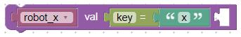 | 
|:--:| 
| *Storing robot's "x" value in a variable* |

Anytime the block above is executed, the “robot_x” value gets updated with the robot’s current “x” value. Of course, it’s momentary, and if later on the robot’s “x” value changes but you don’t call this function again, the “robot_x” value stays unchanged.

<div style="border: 1px solid black; padding: 10px; background-color: #c8e3c3;">
<h3 style="margin-top: 0;">Lab Exercise 1</h3>
    
In this exercise, we want to write our first Blockly program. Complete your code in two steps:

- Create a Blockly program, that commits jmove commands with random joint values. When each command was executed it must wait for 2 seconds before repeating. All joint values should be a random integer chosen between -15 to +15 degrees.
  
- Before waiting for 2 seconds, check if the “y” value of the robot’s Cartesian position is positive or negative, if it is negative the wait must be 4 seconds, and if it is positive wait for 2 seconds.

</div>

---
## **Python Programming**

The Dorna Python API lets you interact with the robot by writing Python codes. 

Writing programs in Python offers several advantages over using visual programming tools like Blockly. Python provides a more extensive and versatile coding environment, allowing for the development of complex algorithms and systems that may be cumbersome or limited in a visual tool. It is a high-level, general-purpose language with a rich set of libraries and frameworks, enabling developers to tackle a wide range of applications from web development to data analysis and machine learning. Python's syntax is clean and readable, making it accessible for beginners while also being powerful enough for experienced developers. Additionally, Python has a large and active community, providing ample resources, documentation, and support. While visual tools like Blockly are excellent for teaching programming concepts and for quick prototyping, they often lack the depth and scalability needed for larger, more intricate projects that Python can easily handle.

Dorna Lab, as well as the Blockly features, offers a Python programming environment, with simple options like playing the code on the controller, stopping the running code, saving/loading, downloading/uploading the code, and also a shell viewer to observe the output and log of your running codes.

|  | 
|:--:| 
| *Python enironement in Dorna lab* |

Each time you press the “▶ Play” button in the Blockly or Python tab, the code you’ve written (or generated using Blockly) will get saved on the controller operating system and executed. The history of these code executions can be found in the “Processes” tab of Dorna Lab.

| 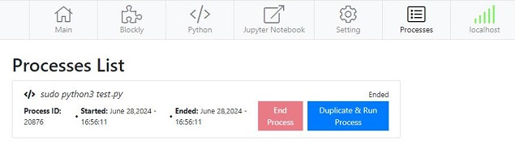 | 
|:--:| 
| *The list of processes* |

Here you can see the history of all the sessions you’ve committed, their current status (whether they are still being executed or their execution has been ended), and The exact time their execution got started and and ended. You can also duplicate (re-commit) these processing sessions, meaning that the corresponding code will get executed again, or you can stop a running process using the "End Process" button.

To get started writing a program, first import the ```Dorna``` class from the ```dorna2``` module, and then create a Dorna object as below. 

```python
from dorna2 import Dorna

# create the Dorna object
robot = Dorna()
```
We should then connect this Dorna object to the robot’s local server using ```robot.connect()```:

```python
if robot.connect(host="localhost", port=443):
    # your code goes here #

    # closing the socket when you are done
    robot.close() 
else:
	print("ERROR: The connecting process was unsuccessful")
```

The role of this object is to bring us all sorts of functions and methods to interact with the robot. As explained in the code above, your interaction with the robot happens after you are sure about the proper connection with the robot, and also after the interactions are all done it is a good practice to close the connections using ```robot.close()```.

### *Dorna Python API’s Methods*
Here we will review the Dorna module’s methods. The “connect” and “close” methods have already been discussed. Other methods that come next are used to send command messages, ask for information from the robot, read, wait for inputs, read the latest updates on any values, and change the outputs.

Here we will list and review these methods:

#### *Cmd Methods*
Methods that help us access the history of all the commands and messages exchanged with the robot

- ```last_cmd()```: Return the last command sent to the robot, in a Python dictionary format.
- ```last_msg()```: Return the last message received from the controller, in a Python dictionary format.
- ```track_cmd()```: This function returns the replies of the commands sent to the robot. This method returns a nested Python dictionary that contains the history of the received messages.
- ```union()```: Return a Python dictionary, consisting of all the keys and their most up-to-date values received from the controller since the connection has been established with the robot.
- ```val(key=”cmd”)```: Return the value of an specific key of the union().

These methods form a very useful set of ways for reading all the robot values e.g. robot’s joint value, position, rotation, input, and output value. You just need to look them up using their specific key: ```val(key=”j0”)``` returns the last communicated value of the robot’s j0. Having access to real-time values of robot’s parameters is crucial for creating reliable robotic applications.

#### *Play Methods*
The play commands are simply methods for sending one or multiple commands to the robot for execution. You’re already familiar with most of the robot’s commands and their JSON structure of “key”s and values. Here you'll see how it's possible to send commands using Python code.

There are many versions of the "Play" function, to decide which one to choose, you have to look at how you’ve prepared the commands' data to commit.

<table>
<tr>
<td>

```play()```

</td>
<td>

Different types of inputs:

- ```robot.play(cmd="alarm", id=10)``` (using Python function input keys)
- ```robot.play({"cmd": "alarm", "id": 10})``` (using Python dictionaries)
- ```robot.play('{"cmd": "alarm", "id": 10}')``` (using a JSON string)


</td>
</tr>


<tr>
<td>
    
```play_script()```

</td>

<td>

Executes commands written in a file, for example storing commands in the file "cmds.txt":

```cmds.txt```:
```
{"cmd":"jmove","rel":0,"j0":0}
{"cmd":"jmove","rel":0,"j0":10}
{"cmd":"jmove","rel":0,"j0":-10}
```
Now we can call all the commands in that file all at once using this Python code:
```
robot.play_script("cmds.txt")
```
Remember that the “cmds.txt” is a relative file address, you have to manage the address to exactly point to where you’ve saved your files. 

</td>
</tr>
</table>

#### *Move Methods*
You have the freedom of of sending your movement commands through the  “Play” methods, or to use the exclusive movement methods available:
- ```jmove()```: This method is basically similar to the ```play()``` method but the ```cmd``` key is set to ```"jmove"```. So, ```jmove(rel=1, j0=10, id=10)``` is equivalent to ```play(cmd='jmove', rel=1, j0=10, id=10)```.

- ```lmove()```: A helper function to send a line move (lmove) command.

- ```cmove()```: A helper function to send a circle move (cmove) command.

#### *Stop and Alarm Methods*
These are a series of helper functions to send stop (halt) commands and read and set the alarm status of the robot. Again it must be noted that all of these tasks could also be done using “Play” methods.

- ```halt(accel)```: A helper function to send a halt command to the robot, with a given acceleration factor (```accel```), and returns the final status of the halt command (```stat```).

- ```get_alarm()```: It gets the robot alarm status (0 for disabled and 1 for enabled).

- ```set_alarm(enable)```: Enable or disable the alarm status of the robot (set enable to 0 for disabling and 1 for enabling the alarm), and return the final status of the command (```stat```).

#### *Joints Methods*
Here are commands for getting/setting joint values and TCP

- ```get_all_joint()```: Get the joint values of the robot, in a list of size 8. Where index i in the list is the value of i'th joint.

- ```get_joint(index)```: Get the value of the joint by index (```0 <= index < 8```).

- ```set_joint(index, val)```: Set the value of the joint index (```0 <= index < 8```) to ```val``` and return the final status of the joint command (```stat```) sent to the robot.

- ```get_all_pose()```: Get the value of the robot tool head (TCP) in the Cartesian coordinate system (with respect to the robot base frame). in a list of size 8. Where indices 0 to 7 in this list are associated with the coordinates ```x, y, z, a, b, c, d, e``` respectively.

- ```get_pose(index)```: Get the components of the robot tool head (TCP) in the Cartesian coordinate system by specifying the desired index. Where indices 0 to 7 in are associated with the coordinates ```x, y, z, a, b, c, d, e``` respectively.

- ```get_motor()```: Get the robot motors status (0 for disabled and 1 for enabled).

- ```set_motor(enable)```: Enable or disable the motors and return the final status of the motor command (stat) sent to the robot.

#### *Wait and Delay Methods*
Methods concerning waiting for an input pin pattern, encoder indices, or delay for a certain amount of time in the program.

- ```probe(index, val)```:  Return the joint values of the robot in a list of size 8 (```get_all_joint()```), the moment that the input pin index (```0 <= int < 16```), is equal to the ```val``` (0 or 1). We can use this method to wait for a pattern of inputs.

- ```iprobe(index, val)```: This method is similar to the probe function but here we are waiting for a specific pattern in the encoder index, instead of an input pin. Return the joint values of the robot in a list of size 8 (```get_all_joint()```), the moment that the encoder index (```0 <= int < 8```), is equal to the ```val``` (0 or 1). Notice that the encoder on the motors gets high (1), 8 times during one full rotation of the encoder, and we can locate these points by calling the .iprobe function.

- ```sleep(val)```: Sleep for val (```float >= 0```) seconds and return the status of the command.

#### *Event Methods*
In robotics programming, efficiently managing the flow of tasks and responses to various triggers is crucial. Traditional programming methods, such as using simple loops to constantly monitor conditions, can be inefficient and lead to performance bottlenecks. These challenges arise because, without a structured event system, the program may waste CPU resources, or worse, miss critical events due to timing issues. This is where implementing an event-driven system offers a more refined and effective solution.

Let’s take a look at a real-life scenario. There is a wall located at the position  ```y=100```, and you are running a complex code on the robot that may stop executing for seconds waiting for the robot to perform a task. You are looking for a solution to stop the robot whenever it  is near the wall: ```y>90``` to avoid colliding with the wall, and you are worried if the robot surpasses this threshold while a motion command is running and the execution of the program is un-hold. 

A solution to the above problem must work parallel to the execution of your program, so it won’t get blocked at all. And it must work with a reasonable frequency. If you think about it, it looks sufficient to check ```y>90```, only whenever there are new updates from the robot (updates come through messages with a relatively high frequency). When there is no new update, there is no new information to check anything.

Here comes the Dorna Module event system, it lets you call your desired function(s) whenever a new message arrives. You can act upon the message however you like. In our case it suffices to just register a function that checks: if ```y>90```   then commit a halt command.


The methods that let you do this are as follows:

- ```add_event(target=None, kwargs={})```: Register a function ```target``` to be called every time a message is received from the robot controller.

The target function always starts with two required parameters, msg, and union. Other necessary parameters can also be passed via ```**kwargs```.

```python
def target(msg, union, **kwargs){
	// Do something each time a message arrives
}
```
Here:
- ```msg``` is the message received from the controller when the target was called (last_msg()).
- ```union``` is the dictionary defined by the ```union()```, the moment that target was called.
- ```**kwargs``` are all the remaining parameters we pass to the target function.

Some other useful functions regarding the events are also:


- ```get_all_event()```: Return the list of all the running events as a list.

- ```clear_event(target)```: This method acts opposite of add_event(), and it removes the event (function) target from the event list. It is important to call this method when we no longer need the registered event.

- ```clear_all_event()```: Removes all the events from the event list.


#### *Input/Output and Auxiliary Axis Methods*
We postpone a detailed overview of the Input/output methods and Auxiliary axes methods to their corresponding chapters.

<div style="border: 1px solid black; padding: 10px; background-color: #c8e3c3;">
<h3 style="margin-top: 0;">Lab Exercise 2</h3>
    

Write a program that generates ```jmove``` command that first starts by bringing the robot to the ```(0,0,0,0,0,0)``` joint values. Next, it creates 30 motion commands in a way that: the i’th command should take the J0 value to ```± i × 10°```, where the sign should be positive for even i values and negative for odd i values. 

Right at the moment when the absolute value of the robot’s y component becomes larger than 100mm the program should halt the robot motion and we except the robot not to perform any motion command afterward. Write this program in one of the two ways, and choose which one suites this task better:

- Commit all the 30 motion commands all at once.
- Commit each command right after the command before it has finished execution.

The step-by-step solution to this problem is available in [this notebook](./codes/LE2.ipynb).

</div>

### *Startup Program*
When designing an industrial robotic system, consisting of the robot and the controller, the robot may need to perform the same task over and over for days, from the time it has been powered on until the time it has been turned off. 

 In order to simplify this task, Dorna TA gives you the option to select a “Startup Program”, the address of a Python code saved inside the controller, that you wish to be executed each time the robot has been powered on. 
 
To select your startup program, write your Python code in the Python tab of the Dorna lab, save it as a file, and copy the address of that file. Then head to the setting tab of the Dorna Lab:

|  | 
|:--:| 
| *Startup programs setting in Dorna lab* |

Enter the full address of the file(s). Click on “Set” button. From now on this code will be executed whenever the controller is turned on.

---
## **Jupyter Notebook**
Using Jupyter notebooks offers several advantages over traditional Python scripting or visual programming tools like Blockly. Jupyter notebooks provide an interactive and dynamic environment, allowing programmers to write and execute code in small, manageable chunks, which is particularly useful for testing and debugging complex robotic algorithms. The ability to combine code with rich text, visualizations, and multimedia in a single document enhances documentation and makes it easier to share and collaborate on projects. 
This environment encourages exploratory programming and rapid prototyping, essential for developing and fine-tuning robotic systems. Additionally, Jupiter’s extensive library support and integration capabilities with various data sources and computational tools streamline the process of implementing advanced functionalities, such as machine learning and data analysis, directly within the robotic programming workflow. In contrast, while visual programming tools like Blockly are excellent for beginners and straightforward tasks, they can become cumbersome for more sophisticated applications, lacking flexibility.

The Jupyter Notebook tab redirects you to a Jupyter session running on the robot.


The Jupiter Notebook environment will open up in a new tab and works for you as a programming environment that will run your code on the controller. 

| 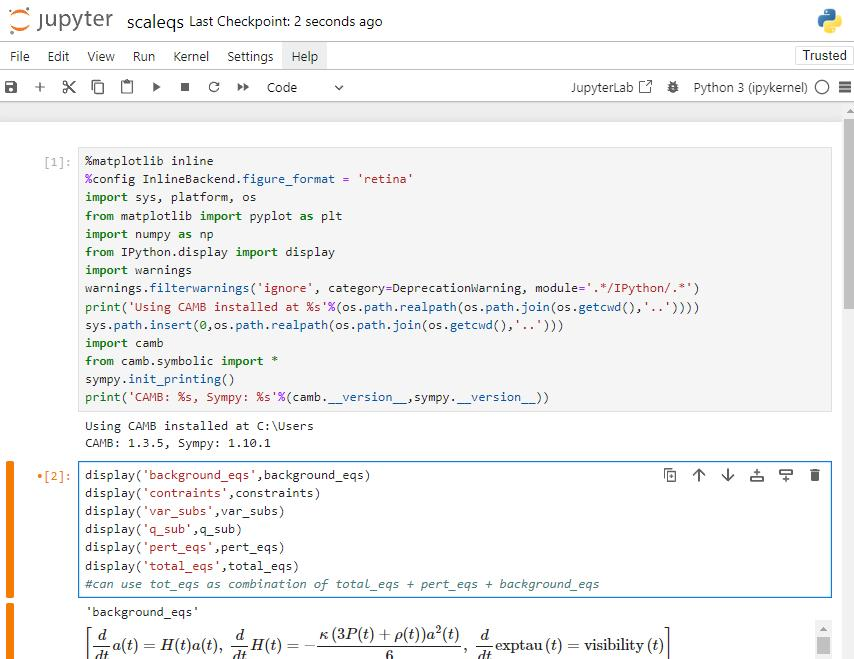 | 
|:--:| 
| *Jupyter notebook* |

You should first create a new notebook or open an already created one to open the notebook environment, the same as the figure above. Use the ➕ button on the top panel to create new input cells and use the dropdown, in the same panel to choose the format of the selected cell. The options for input cell format are either code or text (Markdown). Using the markdown format you can accompany your code with intuitive and clear text material. 

In Jupyter Notebooks, a kernel is a computational engine that executes the code contained within the notebook. When you open a notebook, it is associated with a kernel, and all the code cells you execute are processed by this kernel. The kernel maintains the state of variables, imports, and other computational elements as you run the cells, allowing you to build and test code interactively. You can also restart or interrupt the kernel if needed, which can be useful for troubleshooting or managing resources. Use the kernel panel at the top of the screen to interact with the kernel.

Run a cell by selecting it and clicking the ▶️ play button on the top panel. Or by pressing the keys: “Shift” + ”Enter”. If you don’t get any error message the cell will run as part of your ongoing kernel, it will update the kernel’s data, and it will write outputs as you’ve ordered it (e.g. via print() function).