# **4. Inputs and Outputs**


The input/output (I/O) system is crucial in robotic systems, as it serves as the primary interface between the robot and its environment. This system facilitates the communication and coordination necessary for the robot to perform all sorts of tasks. Inputs from sensors provide real-time data about the robot's surroundings, enabling it to adapt to changes and make informed decisions. On the other hand, outputs control actuators and other devices to execute actions. 

In this chapter, you’ll learn about the role of I/O systems in the field of industrial robotics. As an example, the Dorna TA robot offers a simple and robust I/O system that you’ll learn to work with in this chapter. You’ll learn about the connections, different I/O features, and how to interact with them and use them in real robotics applications.

---
## **Introduction**
In industrial robotics, inputs refer to the data and signals that the robotic system receives from its environment and control interfaces. These inputs can come from various sources such as sensors, cameras, and user commands. Sensors provide essential information about the physical world, including position, orientation, proximity, temperature, pressure, and force, enabling the robot to interact with its environment effectively. Vision systems provide visual inputs that help the robot identify and locate objects for tasks such as sorting, inspection, and assembly. Additionally, user inputs through control panels or programming interfaces allow operators to define tasks, adjust parameters, and monitor the robot's status. 

Outputs on the other hand are the actions and responses generated by the robotic system based on the processed inputs. These outputs include activation of end-effectors (like grippers or welding tools), and communication signals to other machines or control systems. The robot's control unit processes the input data, executes algorithms, and sends commands to the actuators, which convert these commands into physical actions. For example, in a pick-and-place operation, the output involves the robotic arm moving to the object's location, grasping it with a gripper, and placing it in the designated spot. 

| 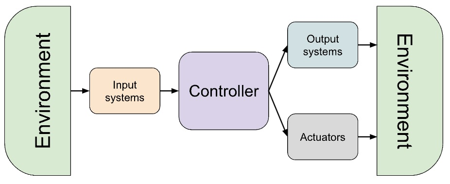 | 
|:--:| 
| *The robotic system I/O diagram* |
---
## **Dorna TA I/O Connections**

Dorna TA offers a robust I/O system that enables the user to connect the control system to a vast range of possible I/O devices.

| 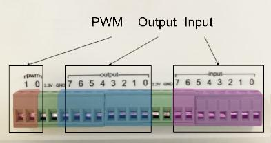 | 
|:--:| 
| *Controller box electrical connection* |

The I/O pins are accessible through a 22-position terminal block header connector with male pins in front of the robot’s controller box. One can use a compatible terminal block plug to connect the wires to these I/O pins.

There are multiple I/O connections available on the controller box and the robot arm, that let you interact with numerous input and output systems at the same time.

Here is an overview of all the input and output pins on the controller and their specific types and properties.

<table>
<tr style=" padding: 10px; background-color: #e6b8af"> 
<td>
    
Digital inputs

</td>   

<td>

8 pins, 24 VDC

</td>
<td>

- Labeled as ```in0```, ... ,```in7```.
   
- With approximately 100 KHz update rate (100,000 times in a second), the controller sends a message upon any change in their values, reporting the new value.
- Use the input command to read the value of input pins.
- Voltage level 0 at an input pin corresponds to digital value 0, and voltage level 24 VDC (Volts direct current) at an input pin corresponds to digital value 1.


</td>
</tr>

<tr  style=" padding: 10px; background-color: #c9daf8" >
<td>

Digital outputs

</td>
<td>

8 pins, 24 VDC

    
</td>
<td>

- Labeled as ```out0```, ... , ```out7```.
  
- Use the output command to read or set the output pins.
- Digital value 0 appears as 0 VDC, and digital value 1 appears as 24 V DC at output pins.
- At the startup, all output pins are initialized to 0.

    
</td>
</tr>
<tr  style=" padding: 10px; background-color: #d9d2e9">
<td>

PWM outputs

</td>
<td>

2 pins, 5 / 3.3 VDC
    
</td>
<td>

- Labeled as ```pwm0```, ```pwm1```.

- PWM pins generate a pulse width modulated signal with a specific frequency (freq) and a specific duty cycle (duty) as depicted in the picture below. The frequency parameter means how many cycles should happen in one second. The duty cycle which is a number between 0 and 100 represents what percentage of a cycle the voltage is high. 
    
</td>

</tr>
</table>

There are also 2 ground pins and 2 pins with constant 24V output available on the I/O connection panels that are crucial for all sorts of applications.

Now let’s dive into more details about the difference between the different types of I/O ports.

### **Digital Signals**

Digital I/O signals play a crucial role in interfacing with external devices and sensors. Digital inputs are used to read signals from external devices or sensors that provide binary information meaning that the input values can only have 2 states, on-off, or active-inactive, or 1-0.  For example limit switches, proximity sensors, and push buttons. The controller interprets the state (high or low voltage) of these inputs to determine the operational status or to trigger specific actions within the robotic system.

On the other hand digital outputs are used to send binary signals (0 or 1) to external devices such as relays or indicators. For example, it can be used for controlling solenoid valves, turning on/off indicator lights, or activating alarms.

This binary communication simplifies interfacing and control tasks, making it straightforward for the robotic system to interact with its environment.

### **PWM Signals**

The PWM (Pulse-Width Modulation) is a signal that oscillates in time, with a rectangular shape with controllable width and duration of the pulse. By controlling these quantities we can alter the mean value of the power delivered. An example of the use cases of this type of control that is relevant to our study of industrial robotics is controlling a DC motor.

| 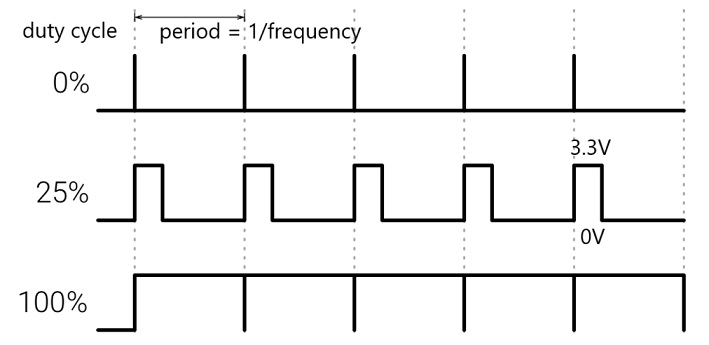 | 
|:--:| 
| *Dorna TA PWM signal levels. You can evaluate the power transferred by calculating the area under these graphs* |

For example, when controlling a DC motor, the PWM signal is used to switch the motor's power on and off at a high frequency. The average power delivered to the motor is proportional to the duty cycle of the PWM signal. At high-duty cycles, the motor receives power for most of the time, resulting in higher speed, on the other hand at lower-duty cycles the motor receives power for less of the time, resulting in lower speed. The motor experiences an average voltage that is proportional to the duty cycle. For example, if the duty cycle is 50%, the motor effectively sees an average voltage that is 50% of the supply voltage.

Hence unlike the digital signals that are only 0 or 1, PWM signals give control over the transferred power, or intuitively, using these signals, we can achieve values between 0 and 1.
Suppose you have a DC motor that runs on 12V.

- **100% Duty Cycle**: The motor sees the full 12V continuously, running at full speed.
  
- **50% Duty Cycle**: The motor sees 12V for half the time and 0V for the other half. The average voltage is 6V, running the motor at half speed.

- **25% Duty Cycle**: The motor sees 12V for a quarter of the time and 0V for three-quarters of the time. The average voltage is 3V, running the motor at a quarter speed.


PWM is efficient because the power transistors are either fully on or off, minimizing the energy loss as heat. PWM allows for precise control over the motor speed by adjusting the duty cycle. PWM circuits can be relatively simple and easy to implement compared to other control circuits.

Keep in mind that while this method of control of DC motor, gives you precise control over the speed of the motor, it is not usable for adjusting the overall rotating value (position) of the motor. For that to be done we will need a feedback mechanism that can be achieved more easily using stepper motors with the help of encoders, which we will discuss in upcoming chapters.

| 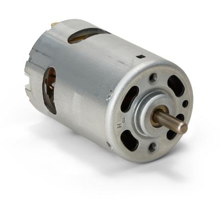 | 
|:--:| 
| *A typical DC motor that can be controlled using the PWM output* |


### **I/O Wiring**

Here we will explore some common wiring strategies for input and output systems. Wiring schemes vary based on the type of device we wish the controller to interact with, whether that device supplies its own electrical power or consumes it from the controller, and also other components. Let’s explore some frequent scenarios in automation applications.

### **Input: Button**
We can use buttons, as a basic and fast way for sending inputs to the controller. The most notable use case for an input button is the emergency button. We discussed the emergency button’s importance as a safety feature in the first chapter. It can be used to quickly halt all robot motion in emergency scenarios. But you can also program a button to ignite all sorts of action from the robot.

A button is usually a simple electrical device that consumes no electrical power, and only uses the user’s mechanical push to connect/disconnect an electrical connection. Since we need a voltage above 12V to communicate a “1” value to an input pin, and the button itself can not supply this voltage, we can use one of the 24V pins on the controller to achieve our goal. This simple design is depicted below.

| 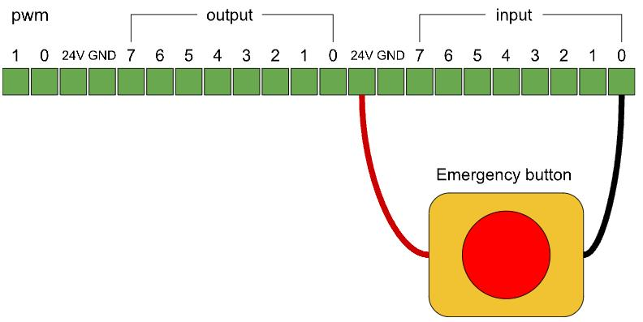 | 
|:--:| 
| *Button input wiring* |

<div style="border: 1px solid black; padding: 10px; background-color: #c8e3c3;">
<h3 style="margin-top: 0;">Lab Exercise 1</h3>
    
The goal of this exercise is to set up a button as a simple input device.

**Step 1**: Setup the button, using the figure above. 

**Step 2**: Check the input values in the Dorna Lab’s I/O panel, what is the the input value when the button is activated or deactivated?

**Step 3**: Use Dorna Lab’s setting panel to set up an emergency system using the button input you’ve installed, specify the value when the button is activated for the emergency signal. Execute a ```jmove``` command and test the emergency button in the middle of the motion.

</div>

### **Input: Another Device’s Digital Output**


There may be input system devices, such as some sensors and PLC devices, that can supply their own voltage difference, these devices only need to connect to the “Ground” pin and the intended input pin so they create the 24V voltage difference between these two pins, whenever there was an input signal. 

We use a shielded cable to connect an output pin of a sensor, a PLC, or another controller device to an input pin of the Dorna controller. We will need to establish a common ground between the two devices and connect the shield of the cable to the controller ground.

This simple wiring has been depicted below. It’s important to connect GND and input wires correctly, and the shield drain wire can also be used, which helps to drain any unwanted electrical noise into the ground. 


| 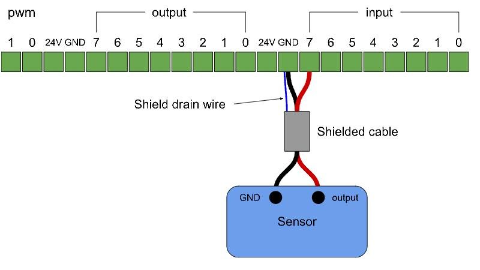 | 
|:--:| 
| *Wiring a sensor system* |

<div style="border: 1px solid black; padding: 10px; background-color: #c8e3c3;">
<h3 style="margin-top: 0;">Lab Exercise 2</h3>
    
This exercise’s goal is to connect one of the controller’s outputs to one of its inputs, so that we could test controlling the input values by changing the output values.
| 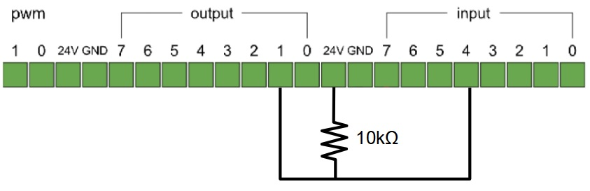 | 
|:--:| 
| *The setup for connecting one of the controller’s outputs to one of its inputs* |

**Step 1**: With the help of your instructor connect the wiring setup as described above. An electrical resistor with an electrical resistor with 10kΩ resistance should be used.

**Step 2**: Using the connection above, which output is connected to which input? Test it with the Dorna Lab’s I/O panel. Set the output value to 0 and 1 and read the corresponding input values (refer to later on this chapter on how to set the output values using Dorna lab).
</div>

### **Output: Controlling Electrical Load**
As for the output systems, a commonly used feature of the controller is to supply a maximum of 2 Watts of power (load) to activate a consuming system. 

The figure below shows how a load is controlled by Digital outputs when connected. The load could be a small DC motor or an LED light.

| 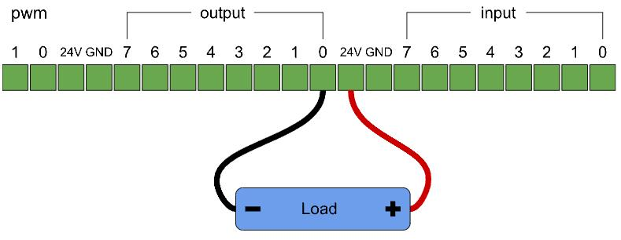 | 
|:--:| 
| *Wiring a sensor system* |

<div style="border: 1px solid black; padding: 10px; background-color: #c8e3c3;">
<h3 style="margin-top: 0;">Lab Exercise 3</h3>
    
This exercise’s goal is to control a small conveyor’s belt motor using the controller’s output system.

The small conveyor belt moves with the mechanical power of a DC motor. You should connect this motor to the robot’s output and then control the conveyor by activating/deactivating the output.
| 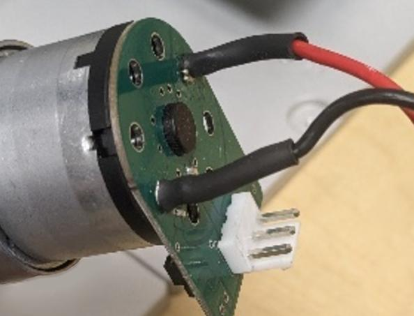 | 
|:--:| 
| *DC motor wiring* |

As shown in the figure above, connect the the motor’s colored wires to the output system of the robot, and control the conveyor using the output control in the Dorna lab’s I/O panel. Connect the red wire to the 24V pin on the controller, and the black wire to one of the output pins.

</div>

### **Output: Digital Output Pin to a Relay**

In many scenarios, the user would like to control a high-power load, such as an actuator, or electric magnet, with a digital output pin using a relay circuit. 

A relay is an electrically operated switch that uses an electromagnet to mechanically control a switch. It allows a low-power control circuit to switch on or off a higher-power circuit, providing isolation between the two. 

We recommend using Mosfet relays as they consume very little power and have a fast response time. The connection will be as follows.
| 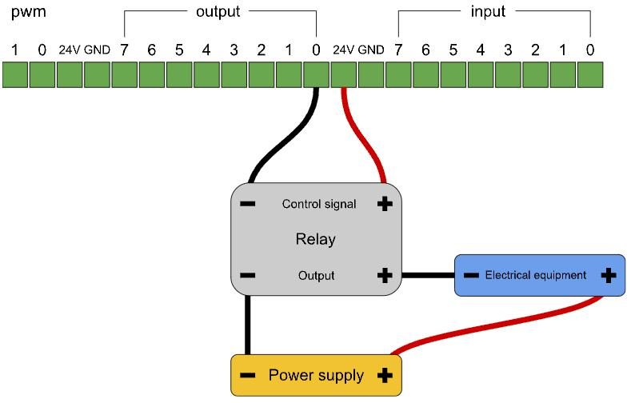 | 
|:--:| 
| *Output control of a relay* |

---
## **Controlling I/O**
The easiest method for controlling and observing the input and output values of the Dorna TA robot is to use the Dorna Lab. There is a special I/O panel on the left, which is the place for getting and setting input and output values.
| 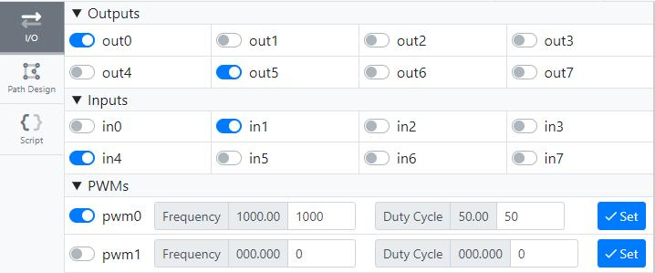 | 
|:--:| 
| *Dorna Lab’s I/O panel* |

Here there are check boxes for output (digital and pwm) and input values. The input check boxes won’t react to your clicks, they just show the current state of the robot’s input, inactive button indicates that the corresponding input has a “0” value, active button indicates that the input has a value of “1”. In the figure above ```in1``` and ```in4``` have value 1 and all the others have value 0.

On the other hand, the output checkboxes react to your clicks, but they only change state when the controller approves that your desired changes have been applied (they stay locked if the controller/computer connection is interrupted). Use these checkboxes to change the controller’s output values. 

The ```pwm``` outputs have more options than just on/off (1/0). You can activate them using the checkboxes, then use the frequency and duty cycles fields to set these values, and click the “Set” button to commit these values. You can check the current values of the frequency and duty cycles in the gray field. 

The Dorna’s command system offers commands for accessing these values. We list all these commands and the corresponding keys below:

<table>
<tr>
   <td><b>Command</b></td> <td><b>Description</b></td><td><b>Keys</b></td>
</tr>
<tr>
<td>
    
```“output”```

</td>
<td>
    
Change the output values using this command.

</td>
<td>
    
Use (```“out0”```, ... ,```“out15”```) for example: ```“out0”:1, “out2”:0``` turns on output 0 and turns off output 2.
</td>
</tr>
<tr>
<td>

```“pwm”```
    
</td>
<td>

Changing the ```pwm``` output values using this command.

    
</td>
<td>

(```“pwm0”```, ... ,```“pwm5”```). For activating the ```pwm``` output, assign its value to 1 and for deactivating it assign its value to 0.

(```“freq0”```, ... ,```“freq5”```). Use these keys for setting the frequency of the corresponding ```pwm``` output.

(```“duty0”```, ... ,```“duty5”```). Use these keys for setting the duty cyle of the corresponding ```pwm``` output.


</td>
</tr>
</table>

The Dorna API offers different ways of reading and writing the input/output values. For reading these values we always have the ```val(key)``` or reading from the ```union()``` dictionary, with keys such as: ```“in0”```, ```“out1”```, and also the ```pwm0``` or ```freq1``` or ```duty0``` keys.  

But there are also special methods created for this purpose that we will list here with the corresponding blocks in Blockly.

- ```get_all_output()```: Get the value of all the 16 output pins in a list of size 16. Where item i in the list is the value of outi.

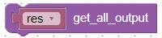

- ```get_output(index)``` / ```set_output(index, val)``` : Get/set the value of output pin index (0 <= int < 16).
  
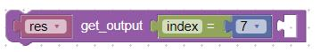


- ```get_all_input()```: Get the value of all the 16 input pins in a list of size 16. Where item i in the list is the value of ```"in-i"```.

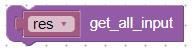

- ```get_input(index)``` : Get the value of input pin index (0 <= int < 16).

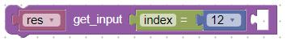

- ```get_pwm(index)``` / ```set_pwm(index, enable)``` : Get/set the value of the pwm channel index (0 <= int < 5)  (set ```enable``` to 0 for disabling this pin and 1 for enabling it.).

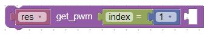


- ```get_freq(index)``` / ```set_freq(index, freq)``` : Get the frequency of a pwm channel index (0 <= int < 5). Or set ```freq``` (0 <= float <= 120,000,000) and return the final status of the pwm command (```stat```) sent to the robot.

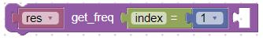


- ```get_duty(index)``` / ```set_duty(index, duty)``` : Get the duty cycle of the pwm channel index (0 <= int < 5). Or we can set the duty cycle of the pwm channel index (0 <= int < 5) to ```duty``` (0 <= float <= 100), and return the final status of the pwm command (```stat```).

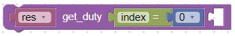


---
## **Programming I/O**

Now that you’ve learned the methods needed to get and set input and output values, it’s time to learn how they could be integrated into our algorithm and programs.

Setting the output values is straightforward. We can always program the controller to change an output value in response to some event, by checking a condition, or at a specific time. It is as straightforward as sending a ```“jmove”``` command, and even simpler because we are assured that it takes no time for the controller to set the output value.

<div style="border: 1px solid black; padding: 10px; background-color: #faeeb6;">
<h3 style="margin-top: 0;">Note</h3>
    
Remember that for output commands, with ```“cmd”``` values: ```“output”```and ```“pwm”```, the default queue is the high-priority queue (```“queue” : 1```), meaning that these commands will get executed right after commission. They do not wait for the commands already in the normal queue to finish processing. You have to take care of the order of command’s execution especially when writing sequential codes. Either set ```“queue” : 0```  in your script to change the output commands' queue to normal queue, or use Python API’s methods that wait for each command to finish executing before running the next command (using ```timeout = -1```).

</div>

<div style="border: 1px solid black; padding: 10px; background-color: #c8e3c3;">
<h3 style="margin-top: 0;">Lab Exercise 4</h3>
    
Here we have two sets of very similar commands A, B, C, and D. Run each set using the Dorna lab’s scripting panel, and in each case, specify the order in which these commands get executed. Specify what would be the final value of ```“out0”``` when all these 4 commands are finished executing.

**1.**
```JSON
A: {"cmd":"jmove","rel":0,"j0":50,"vel":50,"accel":800,"jerk":1000}
B: {"cmd":"output","out0":1}
C: {"cmd":"jmove","rel":0,"j0":0}
D: {"cmd":"output","out0":0}
```

**2.**
```JSON
A: {"cmd":"jmove","rel":0,"j0":50,"vel":50,"accel":800,"jerk":1000}
B: {"cmd":"output","out0":1, “queue”: 0}
C: {"cmd":"jmove","rel":0,"j0":0}
D: {"cmd":"output","out0":0}

```
</div>


On the other hand, working with input values can be a bit trickier. Sequentially we can check input variables in our code whenever needed and get access to their latest updated value. This can be used via if/else statements to achieve the simplest form of a robot’s decision-making. 

| 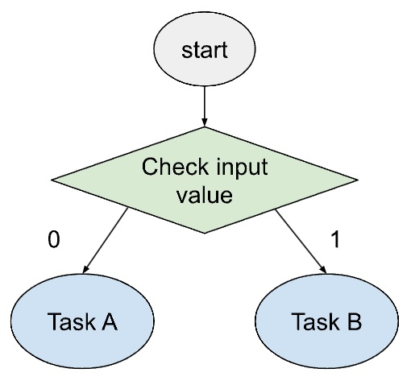 | 
|:--:| 
| *Simple form of decision-making based on input values* |

<div style="border: 1px solid black; padding: 10px; background-color: #c8e3c3;">
<h3 style="margin-top: 0;">Lab Exercise 5</h3>
    
In this exercise, we wish to set up a simple control mechanism for the robot using a button and the robot’s input system.

**Step 1**: Connect a button to one of the input ports, using the wiring setup explained in this chapter.

**Step 2**: Write a Python code that runs a while loop. At the beginning of each loop iteration, the program checks the input value corresponding to the button. If the button is pressed, the program commits a relative joint move command that increases the J0 value by 5 degrees, and if the button is released, the J0 value should decrease by 1 degree with a slow speed. The program should wait for each command to finish executing before iterating the loop again.

The step-by-step code for this exercise is available in [this notebook](./codes/LE5.ipynb).
</div>

### **Probe System**

Another usual form of incorporating input values into the robot’s programming is waiting for an input value to occur using  the ```“probe”``` system in Dorna API. In many scenarios, you may need to hold all the robot’s actions waiting for a specific input event. 

```python
Task_A()
robot.probe(index = 0, val = 1)
Task_B()
```

For example the code above performs ```Task_A()``` and if the ```"in0"``` is zero, starts waiting for it to become 1. Immediately after this happened, the code will perform ```Task_B()```.


<div style="border: 1px solid black; padding: 10px; background-color: #c8e3c3;">
<h3 style="margin-top: 0;">Lab Exercise 6</h3>
    
The goal of this exercise is to use a button for hand-training the robot.

**Step 1**: Prepare the setup in the last exercise (a button). Turn off the robot’s motors.

**Step 2***: create a program that runs a loop. At the beginning of each of the iterations of the loop, the program should wait for the button to be pressed (using the ```probe()``` method). 

The probe method returns the robot’s joint values at the moment the probing input`s value is achieved. Store this returning value in a variable. Use the ```robot.log()``` method to print out the joint values at the moment the button is pressed in the terminal.

Wait for 0.5 seconds before iterating the loop again, using the ```sleep``` method. Why do you think this step is necessary?

Use the setup you’ve built to hand-train some simple motions on the robot. 

The step-by-step code for this exercise is available in [this notebook](./codes/LE6.ipynb).

</div>

In some scenarios, we want to perform a task right after an input pattern occurs, but at the same time, we don’t want to hold all the robot’s actions during the wait. Let’s say our robot doesn’t have a built-in emergency system, and we want to implement it our-self, so the desired input event is the pressing of an emergency button by the user, which should halt all the robot’s motions immediately.

If we use a while loop, that keeps checking this emergency input’s value at all times at a high frequency, waiting for its value to change, we can catch the pressing of the button immediately, but we can’t perform any other robot task at the same time. In other words, this approach is blocking. This means that, while we are running the while loop, all other parts of our code are blocked, and we are not able to use our program to control the system.

There are many solutions to this problem in the field of programming, for now, let’s recall that Dorna API has a ready-to-use solution: the event system.

Using the event system, we can call a function each time the input values have changed, that runs without blocking other parts of the program. The program we talked about above can be written like below using the Dorna API’s event system:

```python

from dorna2 import Dorna

#Defining the function that executes on messages
def on_message(msg, union, robot):
    if "in0" in msg:
        if msg["in0"] == 1:
            robot.halt()
            robot.set_alarm(1)

#Create the Dorna object
robot = Dorna()
robot.connect(host="localhost", port=443)
robot.add_event(target=on_message, kwargs={"robot":robot})

while True:
	#Main loop

robot.close()
```

This program executes the ```“on_message”``` function each time a new message is received. This function first checks if the arriving message contains information about the input we care about (not all the arriving messages are about inputs' change), and then checks the input’s value. If the input is active, it sends the halt command to the robot. Note that this function has access to the ```“robot”``` object using an additional argument that has been passed to it.

You can use the event system as described above, for checking the input value, whenever you needed to act simultaneously in response to the input changes.
