# **5. End of Arm Tooling**


End-of-arm tooling (EOAT) is a critical component in the field of industrial robotics, referring to the devices and tools that are attached to the end of a robotic arm. These tools enable robots to interact with and manipulate objects in their environment, thus allowing them to perform a wide variety of tasks. EOAT can include grippers, welding torches, paint sprayers, sensors, and other specialized devices tailored to specific applications. The versatility of EOAT significantly enhances the functionality and efficiency of robotic systems in industrial settings.

---
## **Different Types of EOATs**
The design and selection of EOAT are crucial to the success of robotic applications. Factors such as the weight, size, and material of the objects being handled, as well as the required precision and speed of the task, must be considered. Additionally, the environment in which the robot operates can influence the choice of EOAT. 

### *Grippers*
Grippers are perhaps the most widely used type of EOAT and come in several forms:

#### *Mechanical Grippers*
Mechanical grippers use fingers or jaws to grasp objects. They are further categorized into two, three, or multi-finger grippers that are usually controlled using electric servo motors. These are suitable for tasks requiring precise control and handling of a wide range of object shapes and sizes.

| 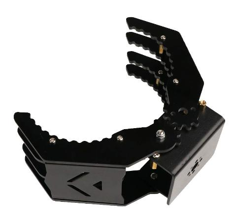 | 
|:--:| 
| *A sample of the mechanical gripper* |

#### *Pneumatic Grippers*
Pneumatic grippers use compressed air to operate their gripping mechanism. They are widely used due to their simplicity, reliability, and speed. Pneumatic grippers can exert significant force, making them suitable for a range of applications, including pick-and-place tasks and assembly operations. They are generally cost-effective and easy to maintain.

| 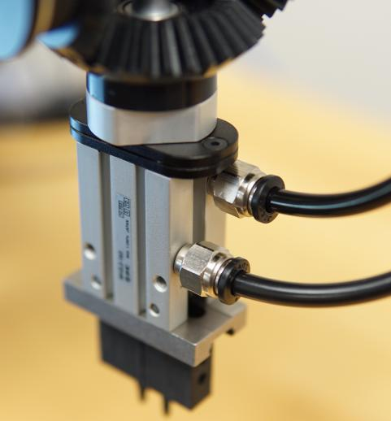 | 
|:--:| 
| *A pneumatic gripper with 2 fingers controlled by compressed airflow* |

#### *Vacuum Grippers*
Vacuum grippers use suction to pick up and hold objects. They are ideal for handling flat or smooth surfaces like glass, metal sheets, or plastic parts. Vacuum grippers are common in packaging, palletizing, and material handling operations. They offer a clean and non-invasive way to handle delicate or surface-sensitive items.

| 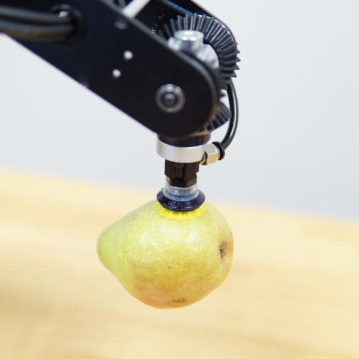 | 
|:--:| 
| *Suction gripper handling object with flat surface* |

#### *Soft Grippers*
Soft grippers are a unique type of end-of-arm tooling (EOAT) that are designed to handle delicate or irregularly shaped objects. Unlike traditional rigid grippers, soft grippers are made from flexible, compliant materials such as silicone, rubber, or other elastomers. This flexibility allows them to conform to the shape of the objects they are grasping, providing a gentle yet secure grip. Soft grippers are particularly useful in applications where traditional grippers might damage the items being handled or struggle to grasp irregular shapes. Some applications of these types of grippers are in food processing and packaging, medical and pharmaceutical applications, and handling delicate electronic components.

| 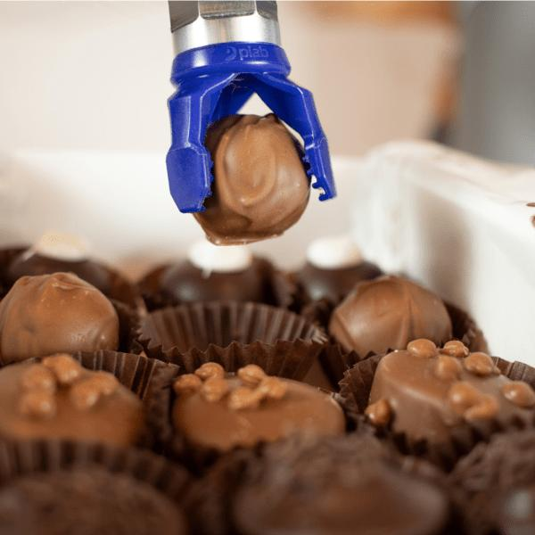 | 
|:--:| 
| *Soft gripper handling a delicate object* |

### *Sensors and Inspection Tools*
Sensors and inspection tools are used to provide feedback and ensure quality control. These can include vision systems, force-torque sensors, and proximity sensors. Vision systems allow robots to identify and locate objects, perform inspections, and guide other EOATs with high precision. Force-torque sensors help robots apply the right amount of pressure when handling delicate objects or performing assembly tasks.

### *End Effectors for Assembly*
These are specialized tools designed for assembly tasks. They can include screwdrivers, nut runners, and rivet guns, among others. Assembly end effectors are used in industries like electronics, automotive, and consumer goods manufacturing to automate the assembly of components and products.

### *Cutting and Drilling Tools*
Cutting and drilling tools are EOATs used to cut, trim, or drill materials. These tools are commonly used in manufacturing processes involving metal, plastic, or composite materials. Robotic cutting and drilling provide high precision and consistency, improving product quality and reducing waste.

### *Specialized EOATs*
In addition to the common types mentioned above, there are specialized EOATs designed for unique applications. For example, robotic grippers used in agriculture may be designed to handle delicate fruits and vegetables without causing damage. Medical robots may use specialized surgical tools for precise operations.

---
## **Tool Mounting**
Each robotic arm has its specifications for mounting tools. The tool may be static with no input/output, or it may be controlled by the robot or gather input using sensors. For each case, we should take care of the proper connections. For example, Pneumatic grippers need to be controlled via compressed air tubes. 

The Dorna TA supports the mounting tool on the end effector (flange) using four M5 tapped holes on the flange surface. Most of the tools come with a proper set of back-plates, that mediate the connection of the tool to the flange. 

|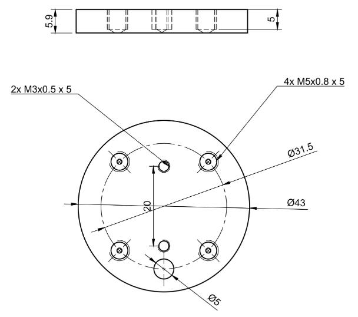 | 
|:--:| 
| *The Dorna TA’s flange structure for connecting tools* |

For example, the figure below shows how a set of back-plates helps us connect a gripper to the flange, without facing a problem installing screws in inaccessible places.

| | 
|:--:| 
| *Connecting a tool to the flange using two back-plates* |

---
## **Pneumatic System**
In most use cases in industry, the tool attached to the end of the robot's job is to interact with the objects in some way, e.g. holding them, moving them, pushing and pulling, and so on. For the tool to be able to interact with objects, it needs mechanical power that is controlled by the controller’s output system. The tool’s mechanical power may be generated on the tool itself (e.g. using electrical motors) or it may be generated somewhere off the robot and transferred to it. A commonly used system for creating mechanical energy and transferring it to the end effector is compressed air, which can be transferred using air tubes. This is called a pneumatic system. This air tube system is already present on the Dorna TA robotic arm, and we will explore how it works, how it can be used, and its common applications in this chapter.

A pneumatic system in robotics uses compressed air to drive mechanical movements, offering a versatile means of control. This system typically involves components such as air compressors, valves, cylinders, and actuators to enable tasks like pushing, pulling, or gripping. Pros of pneumatic systems include their simplicity, high speed, and ability to generate significant force with relatively low energy consumption. 

### *Components of Pneumatic System*

#### *Air Compressor*
An air compressor in pneumatic systems serves as the primary source of compressed air. It works by drawing in ambient air, compressing it to a higher pressure, and storing it in a tank for subsequent use. Compressors are driven by electric motors, and they come in various types, including reciprocating, rotary screw, and centrifugal compressors. The choice of compressor depends on factors such as the required pressure, flow rate, and application specifics.

The air compressor is responsible for a consistent pressure difference in the air tubes. We can check the pressure value from the pressure sensors usually installed on the compressor and we can control it using the compressor’s special control mechanism. Since the resulting force created by the pressure at the end effector, the jaw force of a pneumatic gripper, and the suction force of a suction cup, are proportional to the pressure value, it is important to choose a proper value for it. Different tools require specific pressure values usually to operate properly and safely. For example, using the Dorna TAs pneumatic toolkit, 500kPa is usually a good pressure value.

|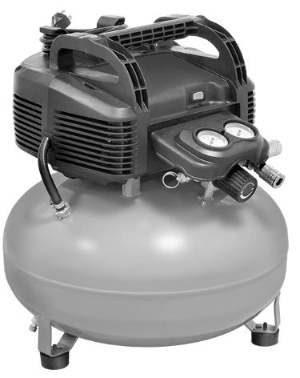 | 
|:--:| 
| *Sample of an air compressor* |


#### *Air Compressor Adaptors*
There is a set of coupler pieces needed to transform the compressor output to the tubes used for transferring the compressed air from the compressor to where it’s going to be used. We always have to find the proper connection pieces to attach the compressor output (usually using a “Universal quick connector”) to the hose. The Dorna pneumatic kit uses a 6mm air tube.

|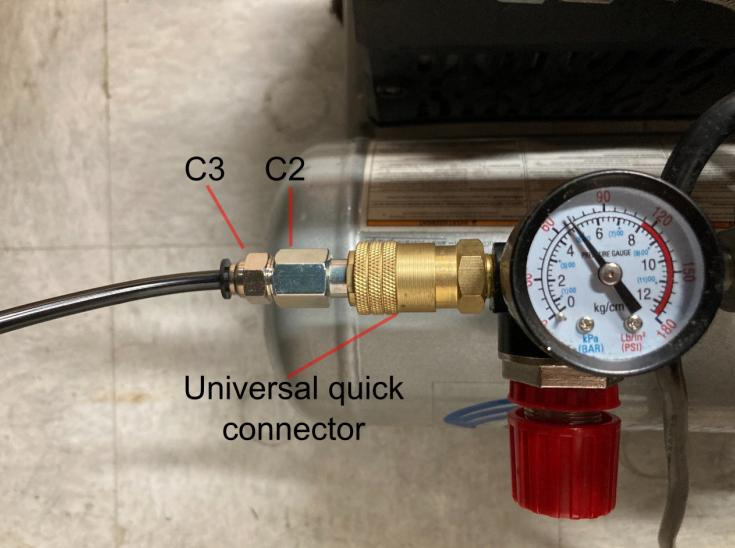 | 
|:--:| 
| *Example pieces for attaching a 6mm air tube to the compressor* |

#### *Control Unit*
Next up on the line is a mechanism for controlling the airflow from the compressor to our system, and guiding it to the parts of the system we wish. This system should take orders from the robot’s controller to allow or to stop the air pressure to flow from the compressor’s air tubes into the tool’s air tubes. Without this controlling device in the middle, the tool could only stay in the activation state. Another benefit of this mediating control unit is that we can branch out the compressor’s air for sending into different parts of a multi-part air-driven tool, and choose between any of the branches. 

In the Dorna pneumatic kit, a solenoid air valve is used. Solenoid air valves control the flow and direction of compressed air. These valves are electrically actuated, using a solenoid coil to open or close the valve, thereby regulating the air pressure. When the solenoid is energized, it creates a magnetic field that shifts the valve's position, allowing air to either enter or exit. 
Let’s explore the solenoid valve more deeply. The valve you are going to work with in this course, has one intake port (```P```), two exhaust ports (```S``` and ```R```), and two outlet ports (```B``` and ```A```).

| 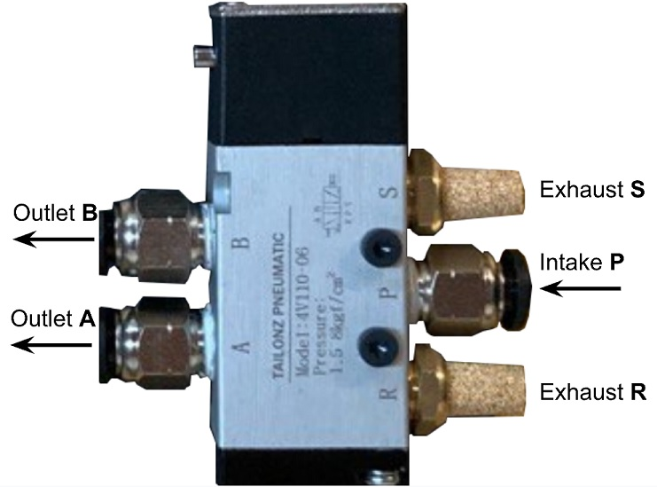 | 
|:--:| 
| *The solenoid valve and its different ports. In this figure, the exhaust ports are sealed off* |

The valve has two states, it’s either energized or not. Let’s see the air connections in both of these cases:

1- When the valve is **not energized** (**turned off**):

|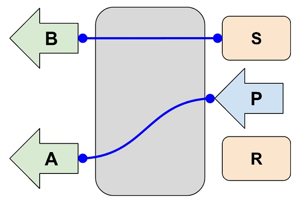 | 
|:--:| 
| *Turned off valve* |

In this case, the ```P``` is connected to ```A``` and ```B``` is connected to exhaust.

2- When the valve is ***energized*** (***turned on***):

|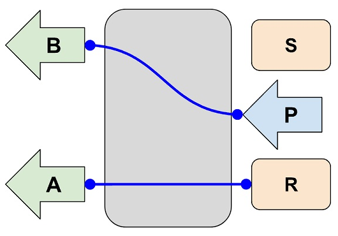 | 
|:--:| 
| *Turned on valve* |

In this case, the ```P``` is connected to ```B``` and ```A``` is connected to exhaust.

So by (de)activating the valve, we are free to drive the airflow into one of the two outlet ports. If in some cases only one outlet port is needed, we can easily seal off one of the outlets and only use the other one. For example, if port ```A``` is closed, the selenoid will flow the air to port ```B``` when activated and will connect B to the exhaust when deactivated. 

#### *Air Transfer*
The air under the control of the solenoid valve should be transferred to the tool at the end of the robot using air tubes. Dorna TA is equipped with a built-in air tube system, with two inputs at the base and two outputs near the end of the robot’s arm. This will save us from attaching external tubes to the robotic arm, that may get tangled or bent improperly, and thus makes installing a pneumatic system much easier.

|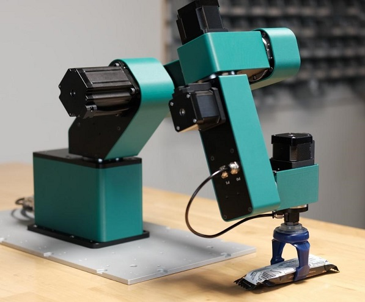 | 
|:--:| 
| *The air outlet’s on the 4’th arm, that can be easily connect to the tool* |

#### *Tool*
Finally pneumatic tool can be attached as the end effector of the robot, and the compressed air is fed to it via the two air outputs at the 4th arm. The pneumatic tool either works with positive air pressure difference (pneumatic grippers) or negative air pressure difference (soft grippers and suction grippers). 


### *Control Wiring*
To be able to control the solenoid using the robot’s controller, we will use a relay already installed on the valve and a PSU (power source unit) that will supply the electric power needed to activate the solenoid. The controller’s output will only connect or disconnect the PSU’s DC current to the solenoid via the relay. 

|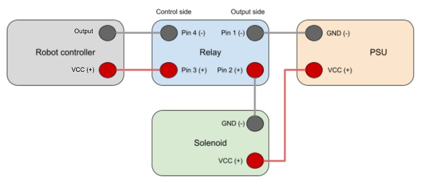 | 
|:--:| 
| *The schematic view of the relay wiring for controlling the solenoid valve using the robot’s controller* |

The figure above shows how the connection should be done. Pin 4 on the relay connects to the output pin on the controller, and pin 3 connects to the VCC(+24V) port on the controller. And a wire should connect the solenoid’s positive port to the PSU positive port, and the relay’s pin 1 to the PSU’s ground.

### *Air Connection*
Now let’s review how the air connection should be set up for different kinds of tools.

#### *Pneumatic Gripper*
These grippers are driven by the force of the air’s pressure. An example 2-finger pneumatic gripper is displayed below. This gripper has two ports called ```S``` and ```O```. Applying pressure to one of these ports will push both fingers toward the center, the pose in which the gripper holds the object, and applying pressure to the other port will push both fingers outward from the center, the pose in which the gripper releases objects.


<div style="border: 1px solid black; padding: 10px; background-color: #c8e3c3;">
<h3 style="margin-top: 0;">Lab Exercise 1</h3>
    
In this exercise, you will set up a pneumatic gripper for the first time and will try controlling it using the output system.

**Step 1**: First start by preparing the solenoid valve setup, use the instruction given in this chapter to connect port ```P``` to the compressor, the PSU connector, and also connect pins 4 and 3 on the relay to the controller. Also, connect ports ```A```and ```B``` of the valve to ports ```O``` and ```S``` on the gripper directly. The figure below will guide you. 
 
**Perform all this setup while the compressor, controller, and PSU are turned off**

|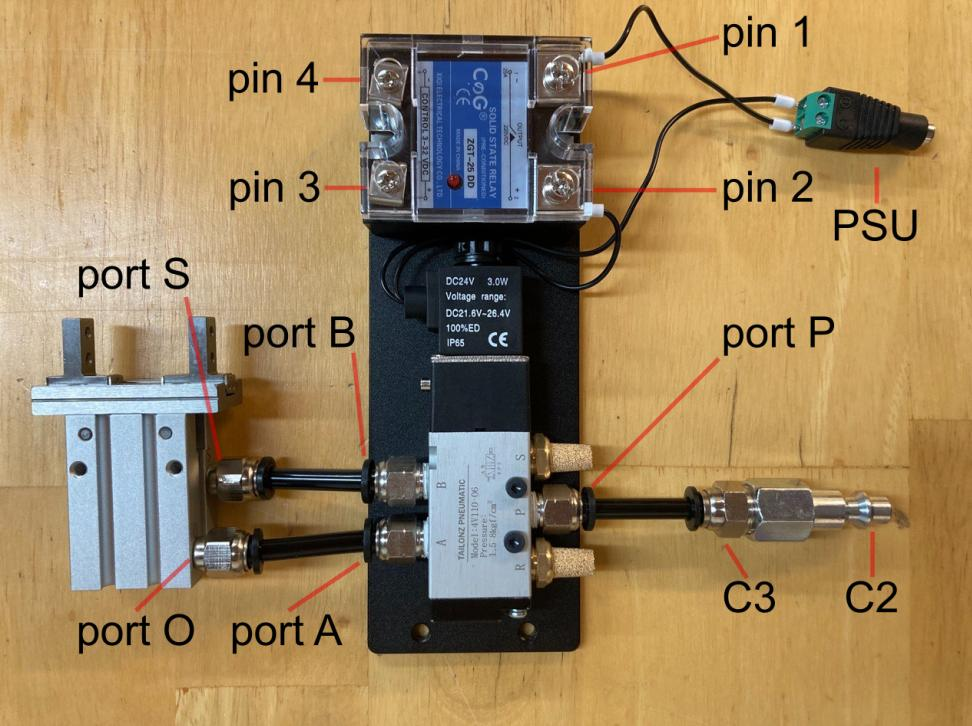 | 
|:--:| 
| *The solenoid valve setup and air connections  for the pneumatic gripper* |

**Step 2**: Now turn on devices, and start by testing what happens when the valve is activated/deactivated. Now try to specify which of the ```S``` and ```O``` ports are responsible for opening or closing the fingers. 

</div>

#### *Suction Gripper and Soft Gripper*
Suction grippers and soft grippers are both used for handling lightweight and delicate items. The main operational difference between these two pneumatic tools and the pneumatic gripper is that the pneumatic gripper works with a positive air difference, but the suction gripper and soft grippers work with a negative air difference (vacuum).

To create a negative air force, using the compressed air setup, we need a new set piece called “Vacuum Ejector”. A vacuum ejector is a device that uses the Venturi effect to create vacuum. It operates by passing high-pressure air through a narrow nozzle, which increases the velocity of the fluid and decreases its pressure. This low-pressure region creates suction, drawing in surrounding air through a secondary inlet. The mixture of the driving fluid and the entrained air or gas then exits the ejector at a higher pressure. 

|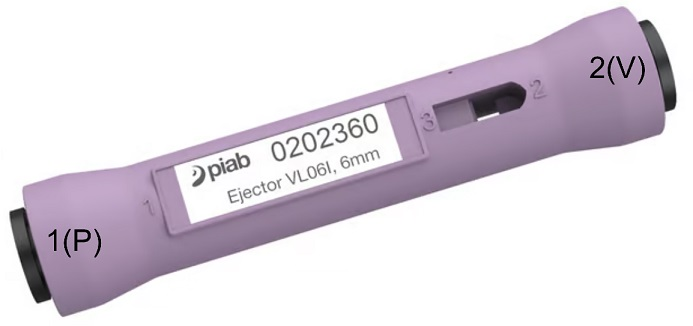 | 
|:--:| 
| *An inline vacuum ejector, compressed air flows in from the left (port 1 or P short for Pressure port) and vacuum happens in the right (port 2 or V short for Vacuum port)* |

The suction and soft grippers both demand the vacuum or negative pressure difference, so we will guide the compressed air into the vacuum ejector, then the resulting vacuum can be fed to these grippers. In this case, only one of the solenoid valve’s outputs is needed, because we only need two states for the vacuum, it’s either active or not.

<div style="border: 1px solid black; padding: 10px; background-color: #c8e3c3;">
<h3 style="margin-top: 0;">Lab Exercise 2</h3>
    
In this exercise, you will set up a suction gripper. You can follow the same instructions for a soft gripper two.

**Step 1**: Repeat the process in the last exercise to connect the valve to the compressor, controller, and PSU. Block port ```A```, and connect port ```B``` to a vacuum ejector’s port ```1```. Connect the vacuum ejector’s port ```2``` to the suction gripper.
 
*Perform all this setup while the compressor, controller, and PSU are turned off*

|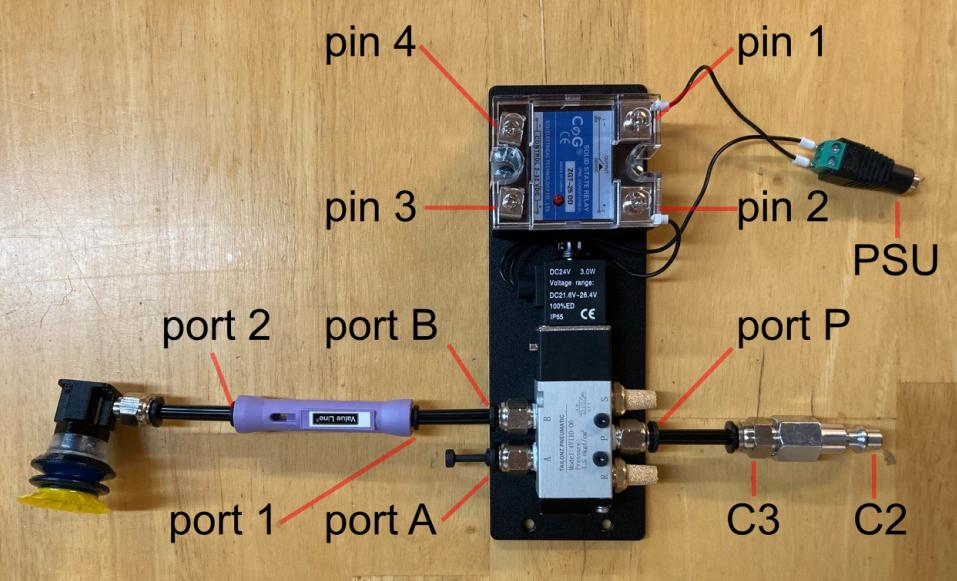 | 
|:--:| 
| *The air connections for a suction tool.* |

**Step 2**: Now turn on devices, and start testing the suction gripper. 

**Step 3**: Repeat the process but this time the gripper should be connected to the end of the robot, and the vacuum ejector should be placed between the valve and the robot’s air inputs at the base. Test gripping some flat objects using this tool, keep track of the weight of your test object. Give an approximate value of the maximum weight this tool can pick up without a problem.
</div>