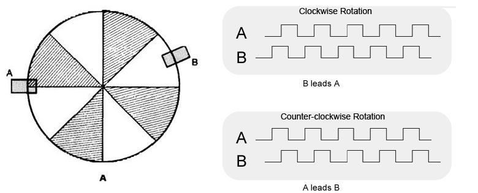
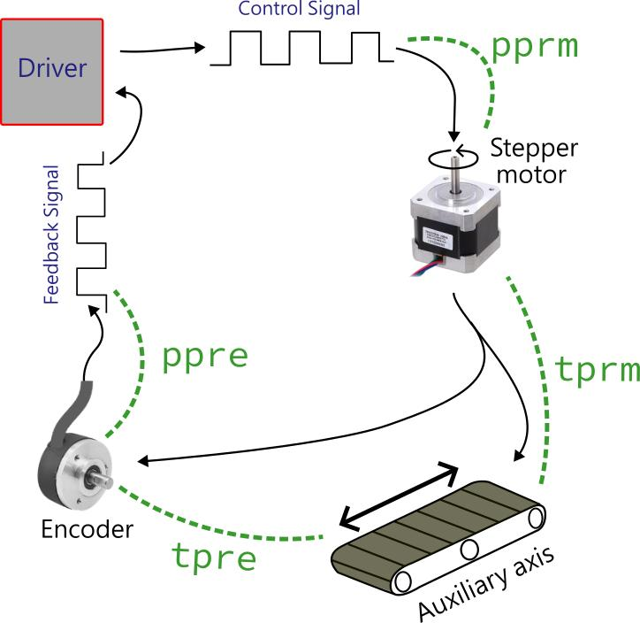
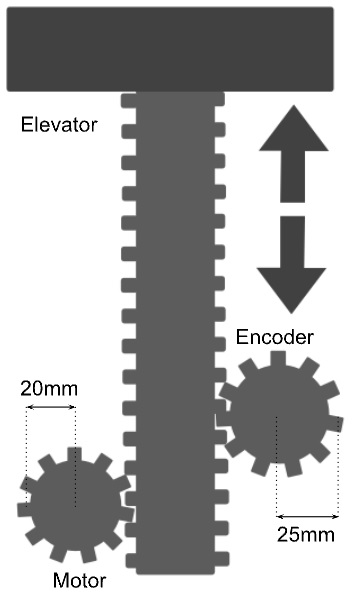
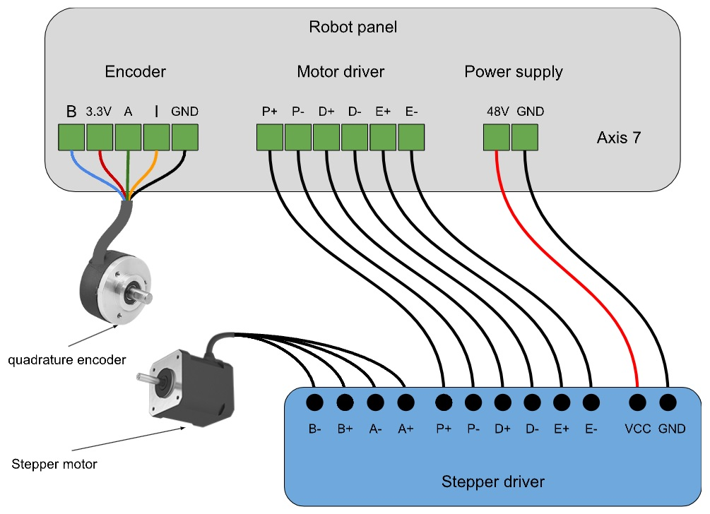

# **6. Additional Axes**

The additional axes refer to the supplementary degrees of freedom added to a robot's primary configuration to enhance its range of motion, flexibility, and versatility. These auxiliary axes, also known as external or extra axes, can be integrated into a robotic system to enable more complex and precise operations, beyond the capabilities of the standard six-axis robots commonly used in industrial applications.

The primary purpose of auxiliary axes is to extend the robot's reach and allow for more intricate movements. For instance, a robot with a seventh axis can move along a linear track, expanding its operational workspace significantly. This additional axis is particularly useful in welding, painting, or material handling tasks, where the robot needs to access various points within a larger area. Similarly, an eighth or ninth axis might be added to enable rotational movements or to manipulate additional tooling, providing the robot with the ability to perform multi-step processes without the need for repositioning.
As for the Dorna TA robot, In addition to the robot's six axes, the controller can operate two additional axes. For each of these two axes, the control system has an additional motor control output and an encoder input port.

In this section, we will go over setting up and using the auxiliary axes with the robot.
In the context of auxiliary axes, we have a motor (optional) that runs an axis (joint) through a gearing mechanism. The controller uses an encoder (optional) data to report the value of that axis as j6, or j7 (depending on the axis number). These two new degrees of freedom in addition to the actuator’s 6 joint values will give us a system with a total of 8 axes of control. 

The control system can handle two new components for each of the additional axes, these two components are explained below. For each additional axis, at least one of them should be present.


1. **Motor**: Most importantly the additional axis has to control a motor with a driver that utilizes pulse and direction signals to control its rotation. The motor will be in charge of the movement for example in the case of  a rail, a stepper motor is in charge of providing the force needed to perform the linear motion.


<div style="border: 1px solid black; padding: 10px; background-color: #faeeb6;">
<h3 style="margin-top: 0;">Note</h3>
    
The "Pulse and Direction" mechanism is a common method for controlling stepper motors, widely used in CNC machines, 3D printers, and other precision control applications. Here's a breakdown of how it works:

**Pulse**

- Pulse Signal (Step Signal): The stepper motor driver receives a pulse signal for each step the motor needs to move. Each pulse corresponds to one step of the motor. The frequency of the pulses determines the speed of the motor. The more pulses per second, the faster the motor will spin (similar to what we learned about PWM control systems)
- Pulse Train: A series of pulses sent in a specific pattern forms a pulse train, which the motor driver interprets to move the motor in a controlled manner.

**Direction**

- Direction Signal: The direction signal tells the motor which way to rotate. This is a binary signal, usually represented as high or low (1 or 0). When the signal is high, the motor rotates in one direction (e.g., clockwise), and when the signal is low, it rotates in the opposite direction (e.g., counterclockwise).
</div>


2. **Encoder**: The encoder on the other hand is in charge of providing data about the axis’s current position. It is a necessary part of precise control, and it can also be used without a motor present in some input systems.


<div style="border: 1px solid black; padding: 10px; background-color: #faeeb6;">
<h3 style="margin-top: 0;">Note</h3>

The encoder used for an auxiliary axis should be an incremental quadrature encoder with ```A``` and ```B``` channels (Index channel ```I``` is optional).

A quadrature incremental encoder is a type of position feedback device commonly used in motion control systems. It translates the mechanical position of a shaft or axis into electrical signals that can be interpreted by a control system to determine position, speed, and direction of motion. 

An incremental encoder typically consists of a rotating disc with evenly spaced slots or transparent sections. A light source (LED) shines through the disc, and on the other side, sensors detect the light pulses as the disc rotates. As the disc rotates, the slots or transparent sections interrupt the light, generating a series of electrical pulses.

Quadrature encoders provide more detailed information by using two output signals, usually called ```A``` and ```B```, which are 90 degrees out of phase (hence the term quadrature). These two channels generate square waves that are offset from each other by one-quarter of a cycle (90 degrees). This phase difference allows the determination of direction.

The direction of rotation can be determined by examining the sequence of the pulses from the two channels. If Channel ```A``` leads Channel ```B```, the encoder is rotating in one direction. If Channel ```B``` leads Channel ```A```, it's rotating in the opposite direction.


|  | 
|:--:| 
| *Determination of the direction of rotation based on the two channels A and B* |
</div>

---
## **Auxiliary axis parameters**

There are some important parameters that we need to know about, to be able to set-up our additional axis’s motor and encoder properly:

- **```pprm```** (*motor pulse per revolution*): Also known as the motor driver micro-step setting, refers to the number of electrical pulses generated by a motor driver for each complete revolution of the motor shaft.

- **```tprm```** (*motor travel per revolution*): Refers to the amount the axis (joint) travels in one full motor shaft revolution. The unit of the travel is irrelevant and can be set by the user. This parameter can be positive or negative depending on the direction of movement of the motor relative to the axis of rotation.

- **```ppre```** (*encoder pulse per revolution*): Represents the number of electrical pulses generated by the encoder for each complete revolution of the encoder shaft (for incremental quadrature encoders, it is commonly referred to as CPR of the encoder).

- **```tpre```** (*encoder travel per revolution*): This refers to the amount the axis (joint) travels in one full encoder shaft revolution. This parameter can be positive or negative depending on the direction of movement of the encoder shaft relative to the axis of rotation.


The picture below shows schematically how different components of a driver-motor-encoder interact with each other and how the parameters defined above relate to different components.

|  | 
|:--:| 
| *Driver-Motor-Encoder system* |

### **Examples**:
Let’s first review some examples to deepen our understanding of these 4 parameters:

1. If the encoder is directly mounted on the motor shaft, then the values of ```tprm``` and ```tpre``` will be the same.

2. A motor runs a rotary axis via a ```1:10``` gearbox. A 10-bit quadrature incremental encoder is mounted directly on the axis, and the driver running the motor is set to a 4000 micro-step setting. In this case, one full revolution of the axis is 360 degrees, so:
    - ```pprm``` is equal to 4000 due to the driver setting.
    - ```tprm``` is equal to 36 degrees, as one full rotation of the motor rotates the joint 36 degrees.
    - ```ppre```  is equal to the encoder resolution 2<sup>10</sup> = 1024.
    - ```tpre``` is equal to 360 degrees, as the encoder and axis shafts are identical.


3. Similar to the previous example but this time the encoder is mounted on the back of the motor and is coupled with the motor shaft. In this case, everything will be similar to the previous case, except ```tpre``` which will be equal to 36 degrees (similar to the ```tprm```).

4. A 4000 micro-step motor runs a linear rail, where one full rotation of the motor shaft results in 10 mm travel of the rail. The encoder also has 14 bits resolution:
    - ```pprm``` = 4000
    - ```tprm``` = 10
    - ```ppre``` = 4096 (= 2<sup>14</sup>)
    - ```tpre``` = 10


<div style="border: 1px solid black; padding: 10px; background-color: #f0f0f0;">
<h3 style="margin-top: 0;">Exercise 1</h3>
    
A stepper motor is used for elevating an object. The motor’s shaft is directly connected to a gear of radius 20mm and the gear moves a linear rack (rack and pinion mechanism). We have also an 8-bit encoder connected to the same rack with a gear of radius 25mm. What are the values of: ```tprm```, ```ppre```, ```tpre```?
|  | 
|:--:| 
| *An elevator with motor and encoder* |
</div>

---
## **Setting Up Auxiliary Axes**
The connectors for the auxiliary axes are available on the back panel of the controller box. After the connection is done, To set up the additional axes you can use the Dorna lab setting panel.
|  | 
|:--:| 
| *The auxiliary axis connection to the Dorna TA’s controller* |

|  | 
|:--:| 
| *Setting up auxiliary axes using Dorna lab* |

In the “Display” subsection the program asks whether you want to see the 7th and 8th axes (remember that we are counting from zero) in the Dorna lab environment. This part of the setting doesn’t change anything on the robot’s side.

Next up you can activate motors and encoders, as you wish, and you can set the parameters ```pprm```, ```tprm```, ```ppre```, and ```tpre``` by typing them in the white fields and clicking on the “Set” button. When the desired numbers appear in the gray fields, it means that your new settings have been applied in the controller.

The same task can be done through the command system, the Python code, and the Blockly.

<table>
<tr>
   <td><b>Command</b></td> <td><b>Description</b></td><td><b>Keys</b></td>
</tr>
<tr>
<td>
    
```“axis”```

</td>
<td>
    
Setting auxiliary axes.

</td>
<td>
    
```"usem6"```, ```"usee6"```, ```"usem7"```, ```"usee7"``` 

Use these keys to activate the additional motors (**usem**) and encoders (**usee**) by setting them to 0 and 1 values.

```"pprm6"```, ```"tprm6"```, ```“ppre6”```, ```“tpre6”```, ```"pprm7"```, ```"tprm7"```, ```“ppre7”```, ```“tpre7”```

Use these keys to configure each new axis parameter.</td>
</tr>
</table>

Also the methods below will help you set these parameters:
- ```get_axis(index)``` : Returns all the information about the axis you specify by the index value.
 

- ```set_axis(index, usem, usee, pprm, tprm, ppre, tpre)``` : Use this method to configure the axis specified by the index.
 

---
## **Configurations**
Depending on the application, there are four distinct configurations available to configure the auxiliary axis of the robot. These configurations can be customized according to your requirements and desired functionality. 

### **Motor**
 
(```usem``` = 1, ```usee``` = 0)

In this scenario, we encounter a motor and a driver that utilize pulse and direction signals to control the motor's rotation, operating without the assistance of an encoder. Stepper motors serve as a prime example of this situation, as they can function accurately without relying on encoder feedback. In other cases, the motor driver itself may possess an internal processor capable of processing encoder data, eliminating the necessity for the Dorna controller to have access to the encoder data during the feedback loop processing. Numerous industrial AC or BLDC servo drivers fall into this category, permitting users to effectively operate these motors by solely sending pulse and direction signals to the driver.

In this case, the robot runs the axis open-loop. This configuration is useful when the encoder is not present, and it is acceptable to run the axis in an open-loop fashion. 

The robot returns the axis value based on the planned motor position data and not the encoder. The resulting joint value is:

```joint value``` = ```tprm``` × ```motor value```

We can rely on the stepper motor’s accuracy without the benefits of a closed loop control system using an encoder, but in applications that put heavy load on the motor or, require high speed, we may lose steps that cause errors and inaccuracies. Without any feedback there would be no way of finding out about errors, thus the need for encoders emerges.

### **Encoder**

(```usem``` = 0, ```usee``` = 1)

This scenario involves solely reading encoder data without the requirement of motor control. For instance, if a user wishes to track the position of a conveyor belt connected to a motor with a constant round per minute, an encoder can be employed for this purpose. The Dorna controller facilitates the reading of encoder values, enabling their utilization for subsequent robot motion planning.

In this case, the robot reports the axis value based on the encoder data 

```joint value``` = ```tpre``` × ```encoder value```

 This configuration is useful for tracking (and not controlling) applications, for example, we can track the DC motor conveyor’s position, which is being controlled using the digital outputs, or any other controlling device. 

### **Motor + Encoder**

(```usem``` = 1, ```usee``` = 1)

In this setup, we seek to operate a stepper motor utilizing encoder feedback data within a closed-loop control system. The Dorna controller lets us control and run the motor and adjust the parameters of the motor and encoder and the controller PID loop. 

In this case, the robot runs the axis closed-loop, using the given encoder and motor parameters, and returns the axis value based on the encoder data 

```joint value``` = ```tpre``` × ```encoder value```

A linear rail with an encoder, or a rotary axis with an encoder are some examples of this configuration. The closed-loop parameters are also specified by the PID values of that axis.

Note that In a closed-loop application, it is important to set signs of ```tprm``` and ```tpre``` parameters consistent with the direction of the encoder and motor rotation. Otherwise, the feedback loop will not be able to converge to the desired position.  

### **No Motor/Encoder**

(```usem``` = 0, ```usee``` = 0)

Both motor and encoder are missing. In this case, the robot reports the value of the joint as 0. Of course this scenario has no practical use case.


