# **8. Robot Vision with AI**

In modern industrial automation, integrating AI vision into robotic arm systems has become essential for enhancing operational efficiency and precision. This chapter provides a practical guide on using AI vision, particularly YOLO, to enhance the capabilities of industrial robotic arm systems.

Traditional computer vision methods, such as those provided in the previous chapter, have been instrumental in developing early robotic arm systems. These methods typically involve feature extraction techniques like edge detection and template matching, which require extensive manual tuning and are often limited by varying environmental conditions. However, with the advent of AI vision, we can now harness the power of deep learning models to achieve superior performance in object detection and recognition.
AI vision, offers several advantages over traditional methods, unlike traditional methods, which may struggle with variations in lighting and occlusion, the deep learning approach allows it to adapt to diverse environments and object appearances. The end-to-end nature of AI vision models reduces the need for manual intervention, streamlining the detection and recognition process.

YOLO, which stands for "You Only Look Once," is a state-of-the-art object detection system that revolutionizes the way objects are detected and classified in images. Unlike traditional methods that apply a classifier to multiple regions of an image, YOLO applies a single neural network to the entire image. This network divides the image into a grid and simultaneously predicts bounding boxes and class probabilities for each grid cell. This approach allows YOLO to achieve speed and accuracy, making it particularly well-suited for real-time applications, such as in industrial robotics, where speed and accuracy matter. YOLO's ability to process images in real-time—often at a high rate of frames per second—enables robotic arms to respond instantaneously to changes in their environment. This responsiveness is essential for tasks such as quality control, sorting, and assembly, where quick and accurate decision-making can significantly enhance productivity and reduce errors. 

As we delve deeper into this chapter, we will explore detailed implementation steps, best practices, and case studies that demonstrate the potential of AI vision in industrial robotic arm systems. 

---
## **How AI Works**
AI vision, particularly through the use of deep learning, represents a significant advancement over classical pattern detection techniques. At its core, AI vision relies on artificial neural networks, specifically convolutional neural networks (CNNs), to learn and extract features from images. The process begins with feeding raw image data into the neural network, which consists of multiple layers, each designed to perform specific operations such as convolution, activation, pooling, and fully connected layers.

Training the network involves feeding it a large dataset of labeled images and using backpropagation to adjust the weights of the filters and neurons, minimizing the difference between the predicted and actual labels. This training process enables the network to learn hierarchical feature representations, starting from simple edges to more complex structures and ultimately to specific objects. Ready-to-use libraries such as YOLO come with pre-trained neural networks, enabling developers to quickly integrate object detection capabilities into their systems without the need for extensive training or dataset preparation.

AI vision excels in real-world applications due to its ability to generalize from diverse training data, making it robust to variations in lighting, orientation, and occlusion. Unlike classical pattern detection, which often requires manual feature engineering and struggles with complex scenes, AI vision systems can automatically adapt and improve as they are exposed to more data. This adaptability and accuracy are particularly valuable in industrial settings, where conditions can vary widely and precision is crucial.

---
## **AI Vision Tasks**
Here are some of the usual tasks engineers use the AI vision systems for. Specific models have to be trained to perform each task effectively.

### **Classification**
In AI vision, classification refers to the process of identifying and categorizing an entire image into a predefined class or category. For example, a classification model trained on a dataset of animals might categorize an input image as containing a cat, dog, or bird. This is a fundamental task in computer vision that enables systems to understand what general type of object or scene an image represents.

| 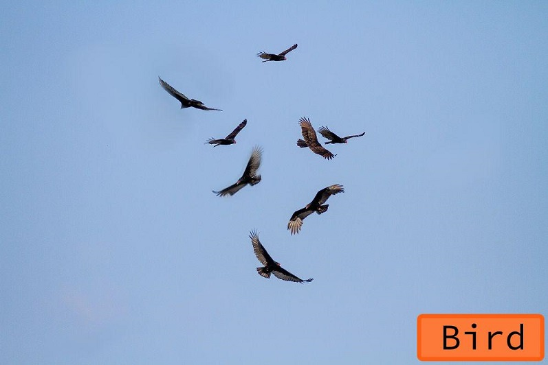 | 
|:--:| 
| *Vision classification* |

### **Localization**
Localization involves not only identifying what objects are present in an image but also determining their locations within the image. This typically means drawing bounding boxes around the objects of interest. For example, in an image containing multiple objects, a localization algorithm will output the coordinates of the boxes that enclose each object, providing spatial context that mere classification does not.

| 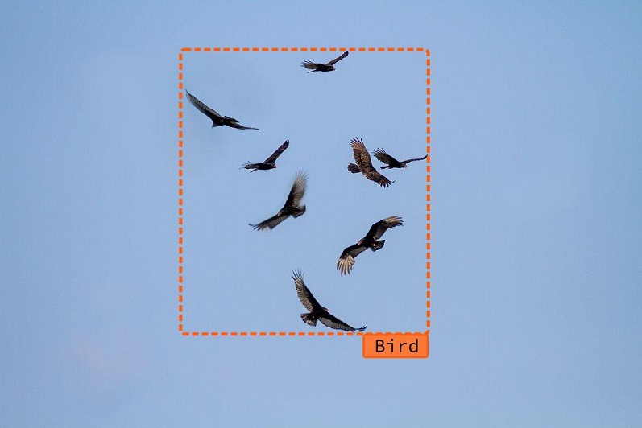 | 
|:--:| 
| *Vision localization* |

### **Object Detection**
Object detection is a combination of both classification and localization. It involves identifying multiple objects in an image, classifying them, and then drawing bounding boxes around each one. For instance, in an image of a crowded street, object detection algorithms will identify and classify pedestrians, cars, bicycles, etc., and indicate their positions with bounding boxes. This is widely used in applications such as autonomous driving and surveillance.

| 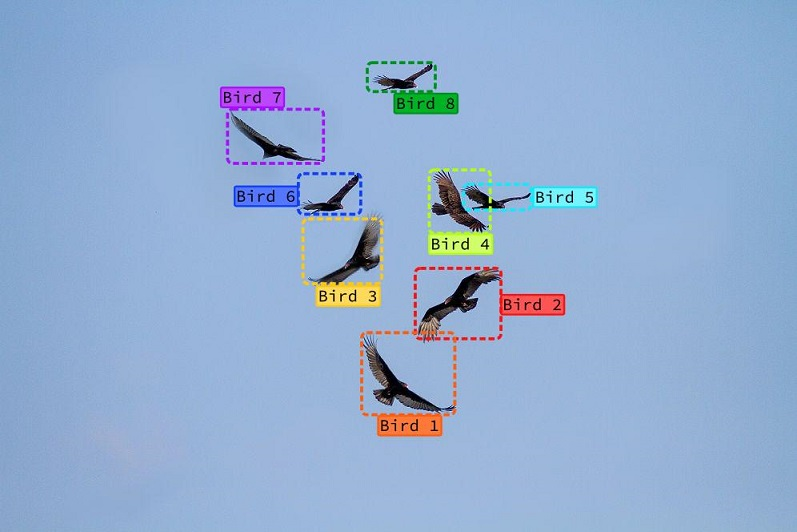 | 
|:--:| 
| *Vision object detection* |

### **Semantic Segmentation**
Semantic segmentation goes beyond object detection by classifying each pixel in an image into a class label, effectively segmenting the image into different regions based on object categories. For example, in an image of a park, semantic segmentation will color code each pixel to indicate whether it belongs to the sky, grass, trees, or people, providing a detailed understanding of the scene's composition.
| 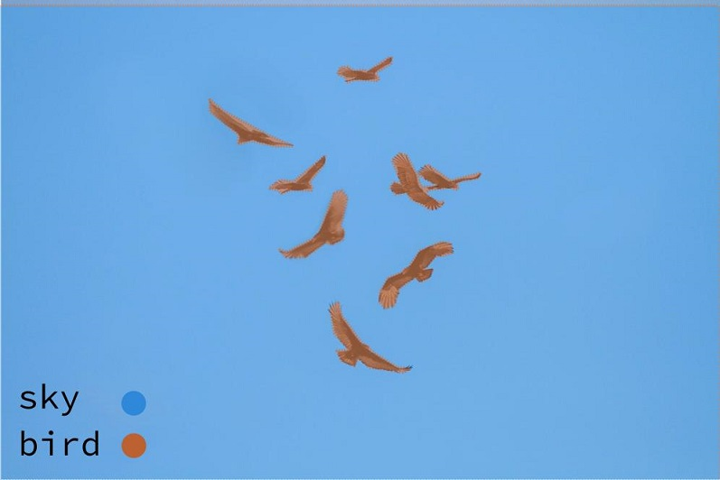 | 
|:--:| 
| *Vision semantic segmentation* |

### **Instance Segmentation**
Instance segmentation is a more advanced form of segmentation where the goal is to identify and delineate each object instance separately, even if they belong to the same class. For example, in a crowded scene with multiple people, instance segmentation will not only classify pixels as belonging to the "person" category but will also differentiate between different individuals, providing a separate mask for each person.
| 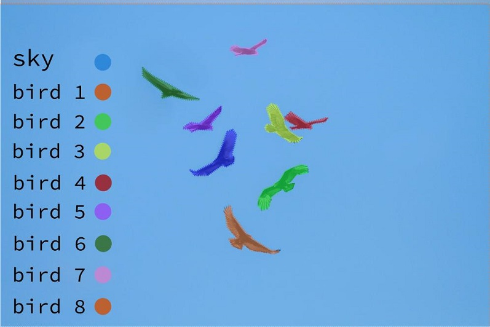 | 
|:--:| 
| *Vision instance segmentation* |

### **Object Tracking**
Object tracking involves following the movement of objects across a sequence of frames in a video. Once an object is detected, a tracking algorithm maintains its identity over time, updating its position as it moves through the frames. This is crucial for applications like video surveillance, sports analytics, and any scenario where understanding the motion and trajectory of objects is important.
| 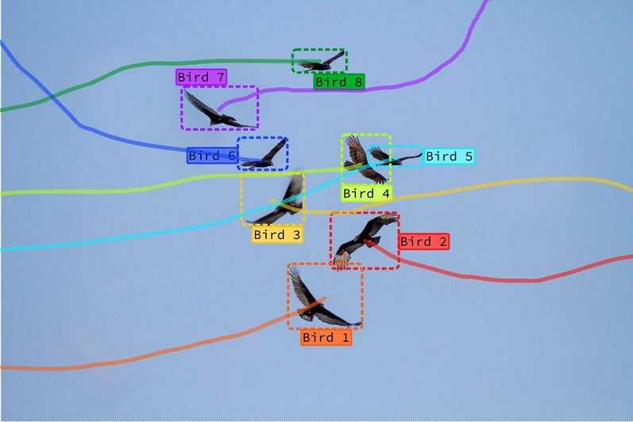 | 
|:--:| 
| *Vision object tracking* |

### **Pose and Keypoint Detection**
Object pose detection aims to determine the orientation and position of an object in a three-dimensional space. This involves estimating the object's pose parameters such as rotation and translation relative to the camera. For example, in augmented reality or robotics, knowing the exact pose of an object allows for more precise interaction with the environment, enabling tasks like grasping or placing objects accurately.
| 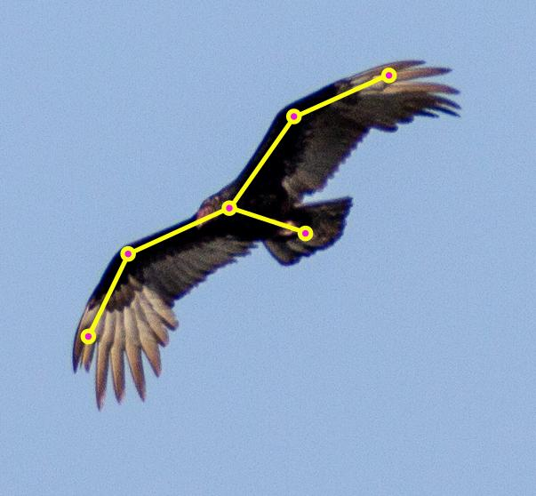 | 
|:--:| 
| *Vision Pose Detection* |


---
## **AI Vision Workflow**
Next up in this chapter, we will explore the AI detection workflow to perform a simple object detection application that is sufficient for many of the object detection applications in an industrial setting. Our detection program uses the library **YOLOv8** as its base AI detection engine, and we will learn intuitive tools such as **Roboflow** for preparing training data. We will learn to use Google Colab’s processing units to train the neural network and we will use the trained model locally on the Raspberry Pi computers for real-time detection.

Use these two notebooks as you go through this chapter as the source code and example project for what you learn.

- [dorna_vision/example/yolo_v8](https://github.com/dorna-robotics/dorna_vision/blob/main/example/yolo_v8.ipynb)
- [dorna_vision/example/vision_guide_yolo_v8](https://github.com/dorna-robotics/dorna_vision/blob/main/example/vision_guide_yolo_v8.ipynb)

### **Training Process**
The YOLO library, as discussed before, is a pre-trained vision model that is capable of performing the detection of some general common objects. The list of objects this model (and many similar general-purpose models) can detect is small and may not contain the object we need to detect in our real-case scenarios. In this case, we have to train the model to detect our desired objects as well. This extra step of training that goes on top of the model’s original training is much less time-consuming and needs a lot less amount of data. The model is already capable of detecting many features in the images, e.g. edges, geometrical features, textures, and so on, and it can easily learn to recognize new categories of objects.

In this section, you will learn to prepare the data and execute the training for a simple “Instance segmentation” task.

#### **Preparing Data**
The essence of machine learning is to train a machine to perform a desired task using sample data, enabling it to perform well on any given data. The more data you provide for training, the better the algorithm becomes at the task.

In the case of the detection algorithm, we should prepare the sample data specifically for detection. You can expect the algorithm to perform well at conditions similar to what you’ve shown to it using the sample data, so it is wise to choose the sample data, as close as possible to the real setting, but as general as possible so the algorithm handles new conditions well. Of course, it is time-consuming to collect data, so you have to be wise and keep your dataset general and small at the same time.

For example, you can start training a very simple and basic model on top of the YOLOv8 library using about 20 sample data (you can improve it later on by adding more data). Capture this number of images, preferably using a camera with the same properties and resolution as the camera you want to perform the detection with. 

| 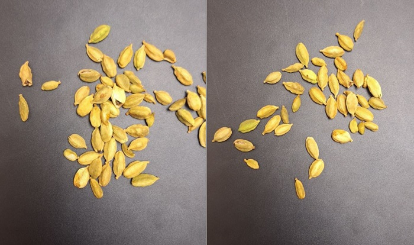 | 
|:--:| 
| *Some sample data that can be used to train the model to detect Cardamom pods* |

As you can see in the figure above, in each data sample, the objects have been randomly moved around and the data sample contains object instances in every possible orientation. The lighting conditions are also good enough to perceive the object from every direction.

After capturing the data has been done, we should perform the task on the data by hand, e.g. instance segmentation. There are tools that help us perform this part very easily. We recommend [Roboflow](https://roboflow.com/), as it offers a useful, free-to-use toolset to do so.

Head to their website, create an account and create a new project. Select a name for your test project and specify the “Annotation groups” by writing down the labels you are going to use in your detection. For example in our case it is just “Cardamom” but it can be multiple labels, meaning that you want your detection system to detect multiple categories of objects at the same time.

Next, you should select your “Project Type” which is the kind of task you want to prepare your data for. We choose “Instance Segmentation” for our example.

| 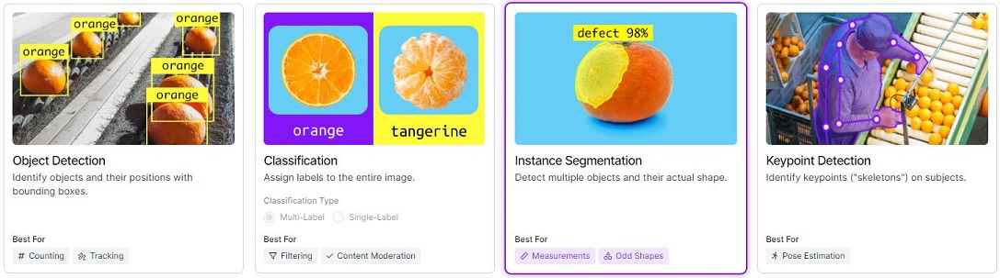 | 
|:--:| 
| *Vision tasks Roboflow can help you with* |

Then create your project and keep in mind that if you are using the free account on Roboflow, your project will be publicly available. This is fine for student projects.

Next step, it asks you to upload all your data images in the project folder. When the upload is complete, you can start working on annotating the data. Choose the manual annotation option, and then start annotating. Start by using the “smart polygon” tool, drawing a bounding box for each instance of the object, it automatically helps you by finding a polygon that encloses it. Edit the automatically detected polygon to match the shape. Then edit (if needed) the label and save the instance. 


| 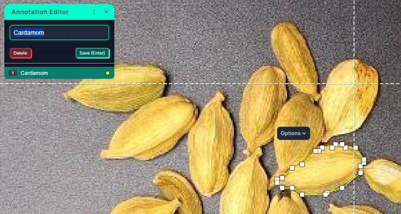 | 
|:--:| 
| *Roboflow helps you automatically match a polygon for instance segmentation* |

Keep going until all the instances in all the images are annotated. You can see a list of all the instances in the “layers” panel. 

After the work is done, come out of the annotation page and click on “Add Image To Dataset”. It will ask you to split images between “Train”, “Valid”, and “Test”. 

In machine learning, data is typically divided into three distinct sets: training, validation, and test data. Each set serves a specific purpose in the model development process:

- **Training Data**: It is used to train the machine learning model. The model learns patterns, relationships, and features from this data. During training, the model adjusts its parameters (weights) based on the input data and the corresponding output labels. This set is usually the largest because the model needs a substantial amount of data to learn effectively.
  
- **Validation Data**: It is used to tune the model and validate its performance during training. Helps in the selection of model hyperparameters (e.g., learning rate, number of layers) and in preventing overfitting. Typically smaller than the training set but still significant enough to provide reliable feedback.
  
- **Test Data**: It is used to evaluate the final performance of the trained model and has no role in the training process. It provides an unbiased assessment of how well the model generalizes to new, unseen data. Similar to or slightly smaller than the validation set.

As Roboflow recommends, a 70%, 20%, 10% (train, valid, test) splitting ratio is good enough for us.

Now the data preparation process has ended. Go to the “Versions” panel of the Roboflow environment, and click on “Export Data”. Select your format “YOLOv8” for Roboflow to prepare the data for training on the YOLOv8 model. 

| 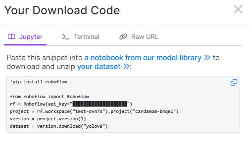 | 
|:--:| 
| *Roboflow helps you automatically match a polygon for instance segmentation* |

Copy the snippet given here to you, you are going to need it later on.

#### **Training**
The next step is to train a model with the prepared data. We are going to use a prepared Google Colab notebook, especially for using Roboflow with YOLOv8. [Use this link to access the notebook](https://colab.research.google.com/drive/191t7vUG9zT2iLlFzI-NBUsqiiupO4eIk?usp=sharing).

Google Colab, is a free cloud-based platform that allows users to write, execute, and share Python code through a Jupyter Notebook interface. It provides a powerful environment for machine learning, data analysis, and deep learning, with seamless integration with Google Drive for easy file storage and access. Colab offers free access to GPUs and TPUs, which significantly accelerates computational tasks, making it an ideal tool for researchers, data scientists, and educators. With built-in libraries and the ability to import custom libraries, Google Colab simplifies the workflow for developing and testing machine learning models, sharing projects, and collaborating with others in real time.

Replace the code in the first cell with the snippet you’ve copied from the Roboflow exporting panel.

The “trained_model_path” parameter in the cell will ask you to give a directory (in Google Drive) and file name for the resulting file to be saved. 

The “pretrained_model” is an important parameter that you should choose carefully, it’s, in fact, the name of the base vision model you want to train on top of (get information in the [YOLOv8 Github page](https://github.com/ultralytics/ultralytics)). All the models in the “YOLOv8” library start with ```yolov8```. The next keyword may be ```n``` (short for nano), ```s``` (short for small), ```m``` (short for medium), ```l``` (short for large), and ```x``` ( for extra large). This keyword specifies the size of the model. We recommend using the ```n``` (nano) model, since it’s lightweight and computationally cheaper and hence good for integration with a Raspberry Pi computer. The next key word that comes after “-” specifies the special task the base model is trained for, the options are: specifying nothing means detection (detection with a simple bounding box, which is what YOLO was originally made for), ```seg``` for segmentation, ```pose``` for pose detection, ```obb``` for oriented bound box detection, and ```cls``` for classification. For example, we are going to use the nano model for the segmentation task hence: ```yolov8n-seg```.

Run the cells. The second cell will ask you to give Colab access to Google Drive, this is to use Drive to save the trained model. Create a “weight” folder in the root directory of your Google Drive and permit the notebook to have access and save the files in this folder.

Running the next two cells will start training the model. The training process is broken into epochs, wait until all the epochs are done, it may take up to an hour or more to complete. After the training is finished, run the next cells to save the trained model in the Drive. 

The trained model will be saved in the ```weight``` directory in your Google Drive and it’s ready to use for detection. At this point, we are done with the Colab environment and we can get back to our local systems.

#### **Integrating the Trained Model**
Go to the “weight” folder in your Google Drive and make the saved model weights file available for anyone who has the link. This makes it easy for the robot’s controller (or our local system) to download the weights without needing the process of giving it necessary access. Copy the given link.

We are going to follow the steps in [dorna_vision/example/yolo_v8](https://github.com/dorna-robotics/dorna_vision/blob/main/example/yolo_v8.ipynb) notebook to integrate the trained weights for the detection task. Open this notebook in the controller, and copy the Drive link you copied, to the “url” parameter in the first cell. Choose the ```model_path``` parameter as the local path+name you want the weight files to be saved with (Note that the given name should have the ```".pt”``` format).

Running the next cells will download the model and make it ready for you. After the download is complete you can always use the ```model = YOLO(model_path)```, to import the model whenever needed.  The ```exported_model = model.export(format="ncnn")``` Code will create a new model based on the original model that is way more compact and lightweight, Then the code ```net = YOLO(exported_model, task="segment")``` Import this newly exported model again so we could perform detection using it. Note that you have to specify the “task” properly. 

The code below shows how we can perform the detection process.

```python
# get camera input
_, _, _, _, _, color_img, _, _, _= camera.get_all()

# perform the detection detection
results = net(color_img, half=True, max_det=10, conf=0.55)
```
The ```max_det``` parameter is the maximum number of detected instances, and ```conf``` is the minimum confidence level you want to be detected.  In the above code, the confidence value is 55% hence only the instances with confidence levels above 55% will be detected. 

It is possible to plot the detected segmentation and bounding boxes results using the code below.

```python
# Visualize the results on the frame
annotated_frame = results[0].plot()

# Display the image
fig, ax = plt.subplots(frameon=False)
ax.imshow(cv2.cvtColor(annotated_frame, cv2.COLOR_BGR2RGB))
plt.show()
```
| 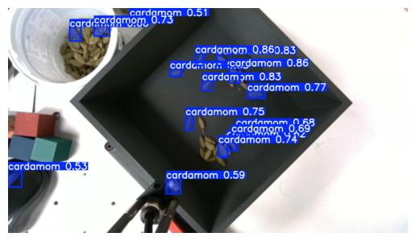 | 
|:--:| 
| *The resulting plot of the detection process, as you can see some of the instances with confidence below 55% are not shown here* |

Next, we should learn how we can use the output data, to program the robot. All the data we need is returned to us in the list of dictionaries that we have saved in the variable “results”. This is a sorted list (in descending order of confidence value) of each detected instance’s information.

There is a useful function defined in the notebook [dorna_vision/example/vision_guide_yolo_v8](https://github.com/dorna-robotics/dorna_vision/blob/main/example/vision_guide_yolo_v8.ipynb) called: ```object_location()``` that you can use easily to locate detected objects from the vision detection data, or you can customize and modify this code to achieve other desired outcomes. 

Let’s take a look at the inputs of this function, other than the ```robot```, ```kinematic``` and ```camera``` instances that we usually define at the beginning of our programs, ```T_cam_2_j4 which``` is a given matrix, and the camera outputs ```depth_frame``` and ```depth_int```, we should pass the ```results``` variable, the results of the detection algorithm, and two threshold limits: ```area_thr``` and ```xyz_thr```. ```area_thr``` sets higher and lower bounds on the instance, and ```xyz_thr``` does the same for its coordinates in 3D space, meaning that it bound the detected object to be inside a 3d bounding box. An example value for these two thresholds can be:

```python
#area_thr = (min_area, max_area)
area_thr = (100,10000)

#xyz_thr = [(min_x, max_x) , (min_y, max_y), (min_z, max_z)]
xyz_thr = [(-1000, 1000), (-1000, 1000), (-1000, 1000)] 
```

The output format of the object_location function is like this:

```python
xyz_target_2_base, pxl, sol = object_location(...)
```

The ```sol``` output has True/False values, True means that an instance of the object with the desired properties has been detected, and False means that it hasn’t been detected. So at this point, you should stop your program from going further if ```sol``` is returned False.

The ```pxl``` is the 2D coordinate of the detected instance with the highest confidence value and the ```xyz_target_2_base``` is the translation vector of this detected object in the base frame, which is ready to use for creating robot motion commands.

<div style="border: 1px solid black; padding: 10px; background-color: #c8e3c3;">
<h3 style="margin-top: 0;">Lab Exercise 1</h3>
    
In this exercise, we want to teach the robot to detect human faces and point at them.

**Step 1**: Gather a dataset of at least 20 pictures, that contain human faces. To do so you can photograph your surroundings (don’t take anyone's photo without their permission!) or use pictures available online. The photos should contain multiple human faces, in different orientations and light conditions. The faces may be near the camera or far away.

**Step 2**: Upload the photos to Roboflow to label the human faces, create a project, and add your teammates, so that you can work on the annotation job at the same time. You can just use the "Object Detection" method and annotate the data by drawing the bounding boxes. 

**Step 3**: Prepare the data, perform the training, and save the trained model in a Google Drive directory. Integrate your trained model into your robot program. Make it ready to detect human faces and report the human face with the highest confidence factor’s position with respect to the base frame. Create a detection loop for the robot that iterates every second (place ```time.sleep(1)``` at the end of the loop).


**Step 4**: In this step, our goal is to get the face’s position and make the robot point at it. To do so, we are going to work in the Joint space, and we will only change the J0 and J1 values of the robot and we will fix other joint values to zero. Let’s say you’ve acquired the Cartesian coordinate of the human face in the base frame calling it ```t_face_2_base``` which is a 1x3 ```numpy``` array.

First, normalize this vector:

```python
import numpy as np

t_face_2_base = t_face_2_base / np.linalg.norm(t_face_2_base)
```

Now calculate J0 and J1 based on these formulas:

```python
J0 = np.arctan2(t_face_2_base[1] , t_face_2_base[0])
J1 = np.arcsin(t_face_2_base[2])
```
But keep in mind that the J0 and J1 values above are in radian units and you should transform them to degrees. Create a ```jmove``` command based on these values. Implement this code in a separate function and call this function in your vision only if the detection has been successful in that iteration. Otherwise, the robot should stay stationary.

</div>