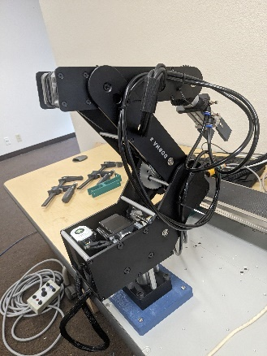
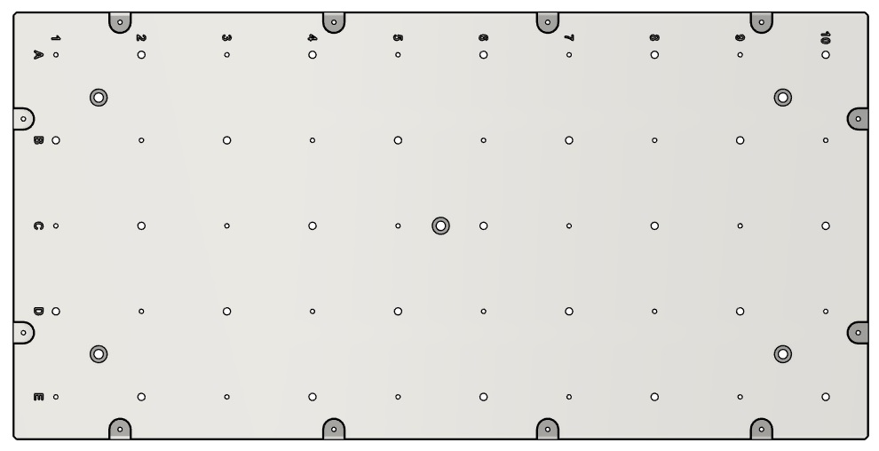
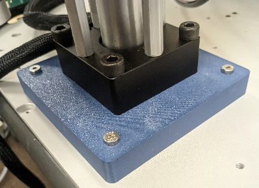
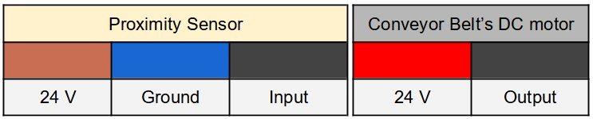
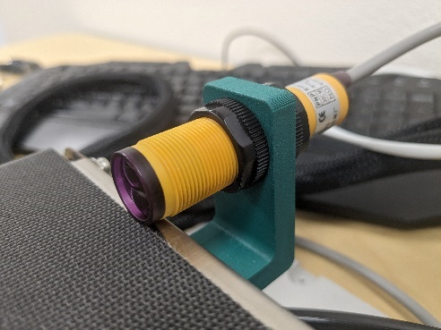
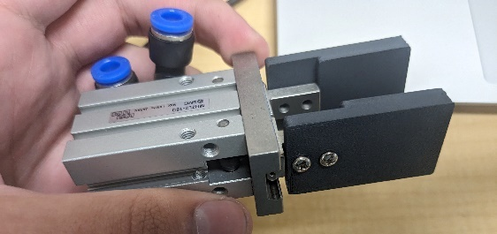

# **Conveyor Pick and Place**

## **Overview**
In this project, we wish to implement a simple robotic system incorporating input and outputs to accomplish a simple pick-and-place task on a controllable conveyor belt. You will follow the step-by-step instructions to program the robot to control the conveyor based on the proximity sensor’s data and to move around objects on the conveyor using a pneumatic gripper. This practice is similar to many real scenarios in the industry such as packaging and assembly tasks.

The input device is a proximity sensor that activates whenever it senses the presence of an object in proximity to it. On the other hand, the output system is a conveyor belt, and we can control its motor using the controller’s digital output pins. 

At the end of this project, small boxes are moved using the conveyor. Whenever they reach the end of the conveyor, it stops. The robot picks up that box using the gripper and moves it to the front of the conveyor, and the conveyor starts moving again, and the loop continues.

## **Parts**
| **Part** | **Description/Image** |
|:---|---|
| [Robot mounting parts](https://github.com/dorna-robotics/education/tree/main/mount_robot#parts) |    |
| [Robot pneumatic gripper]() |    |
| [2 x Base plate connectors](https://dorna.ai/) |  |
| Proximity sensor |  |
| Small Conveyor Belt| | 
|Conveyor Belt Mounting Brackets (also sensor mount)| | 
|Dorna two Mounting Plate Adapter/Bracket| | 

## **Assembly instructions**

1. **Wiring Conveyor Belt**
    Start by detaching the motor from the conveyor belt, this can be done by removing the 4 bolts on the front of the belt’s chassis.

   

Solder an 18-gauge wire to both the power and ground terminals on the motor. Solder the red and black to the same terminals shown below.

   

   
Reattach the motor. Then, using the green terminals on the front of Dorna's control box, connect the Red to the 24v and the black to one of the output connections (in this case, 1 was used). Here we can also observe how the proximity sensor has also been attached to the controller as an input device (here it is input 6)

   

Plese follow the indictation below for the connections of wire of the input and output systems in this project:

   

Now the belt is connected and it can be controlled via the output system of the robot. 

2. **Mounting Conveyor Belt**
   First, use the four black M5 bolts to attach the conveyor mounting brackets to the Aluminum Mounting Plate.

   

Then, use the four black M3 bolts and the M3 nuts to mount the conveyor belt to its mounting brackets.

   

3. **Mounting Sensor**
Mount the Infrared Sensor to the left conveyor mounting bracket through the hole on the bracket and plastic nuts on the sensor. Pay special attention to aligning the sensor at the edge of the conveyor belt to get the most accurate readings.

   
 

4. **Mount the robots**   
   Follow the [mounting instructions](https://github.com/dorna-robotics/education/tree/main/mount_robot#assembly) instructions to prepare the robot. To mount the robot on the plates, start by pressing the four M8 nuts into the hexagonal holes on the bottom of the Dorna to Mounting Plate Adapter.

   
   

   Using the four black M8 bolts attach the Dorna 2 to the Mounting Plate Adapter. Using the four silver M5 bolts attach the mounting plate adapter to the aluminum mounting plate. 

   

5. **Attach the pneumatic gripper**  
   Attach the pneumatic grippers to the robot following the #proper link. Install the Jaws on the gripper.
   
   

Attach the tubing to the solenoid valve. 

   
   
Run one tube from the solenoid valve to the compressor.

   

We should also connect the solenoid wires to the controller as another output device (here we have used output 7) just like below.

   
