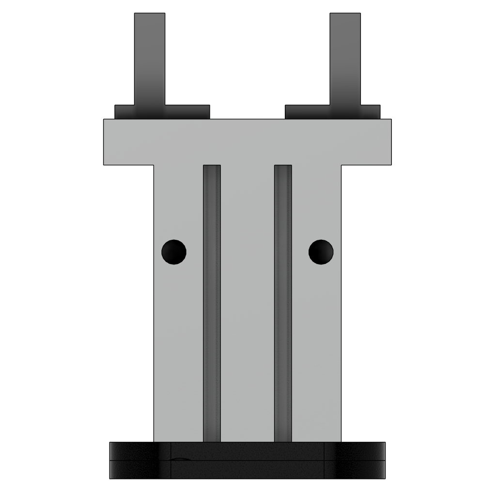
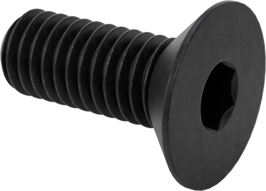
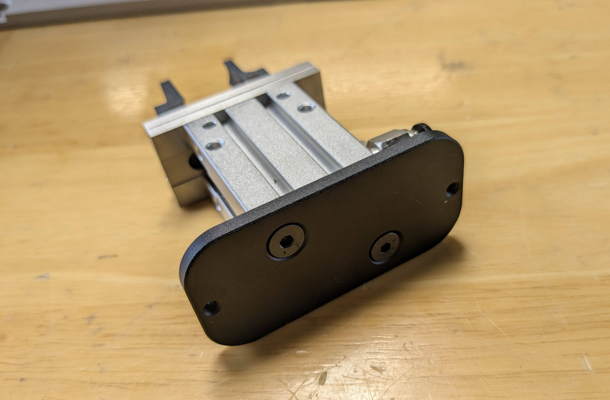
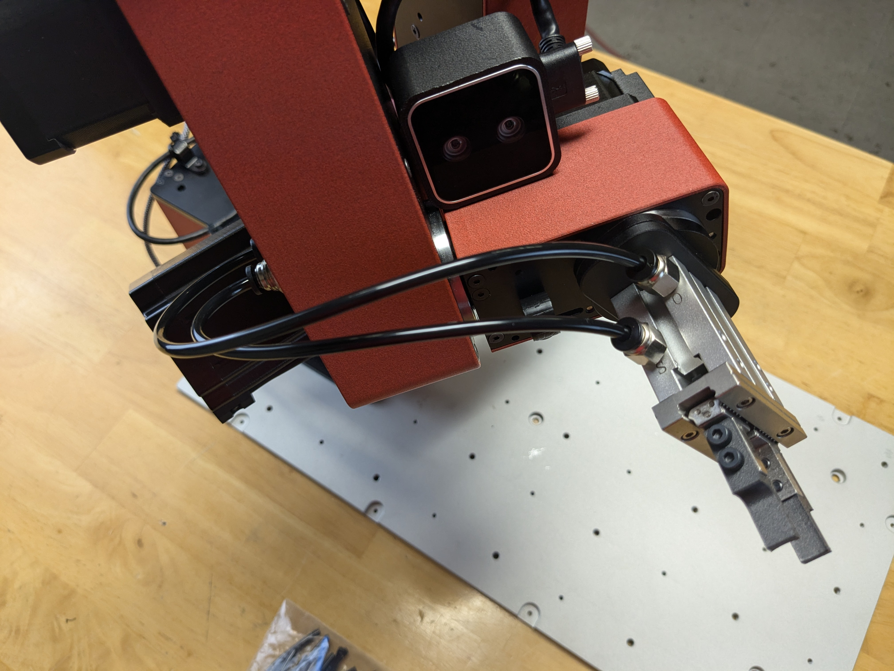

# **Attaching the Two-Finger Gripper to the Dorna TA Robotic Arm**

## **Overview**
This guide provides step-by-step instructions for connecting the two-finger pneumatic gripper to the Dorna TA robotic arm.

## **Parts**
| **Part** | **Description/Image** |
|---|---|
| [1 x Two-finger pneumatic gripper kit](https://dorna.ai/grippers/pneumatic-gripper-kit/) |  |
| [4 x M3 8mm flat head screws](https://www.mcmaster.com/91294A128/) |   |
| [2 x M4 8mm countersink screws](https://www.mcmaster.com/91294A188/) |   |

## **Assembly instructions**

1. **Mount the gripper plate to the tool head**  
   Secure the gripper plate (with 4 central holes) to the Dorna TA tool head using 2 M3 8mm flat head screws.  
   

2. **Attach the gripper to the gripper plate**  
   Fasten the gripper to the gripper plate using 2 M4 8mm countersink screws. Use the 2 diagonal holes for this connection.  
   

3. **Secure the gripper plates together**  
   Connect the gripper plates (attached to the gripper and the tool head) using 2 M3 8mm screws in the side holes of the plates.  
   

4. **Connect the pneumatic tubing**  
   Attach the pneumatic tubes to the gripper using the pneumatic ports on the Dorna TA.  
   

# **Pneumatic Instructions**
   Connect the A and B ports on the back of the solenoid to the 0 and 1 ports on the back of the robot.
    
   

