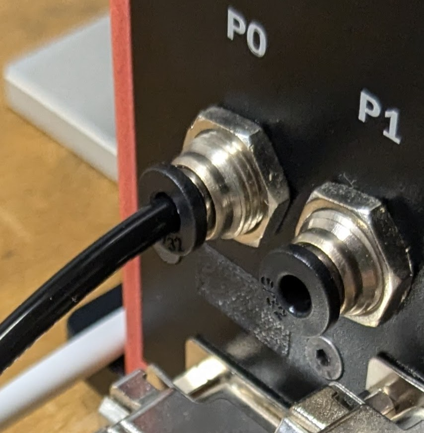
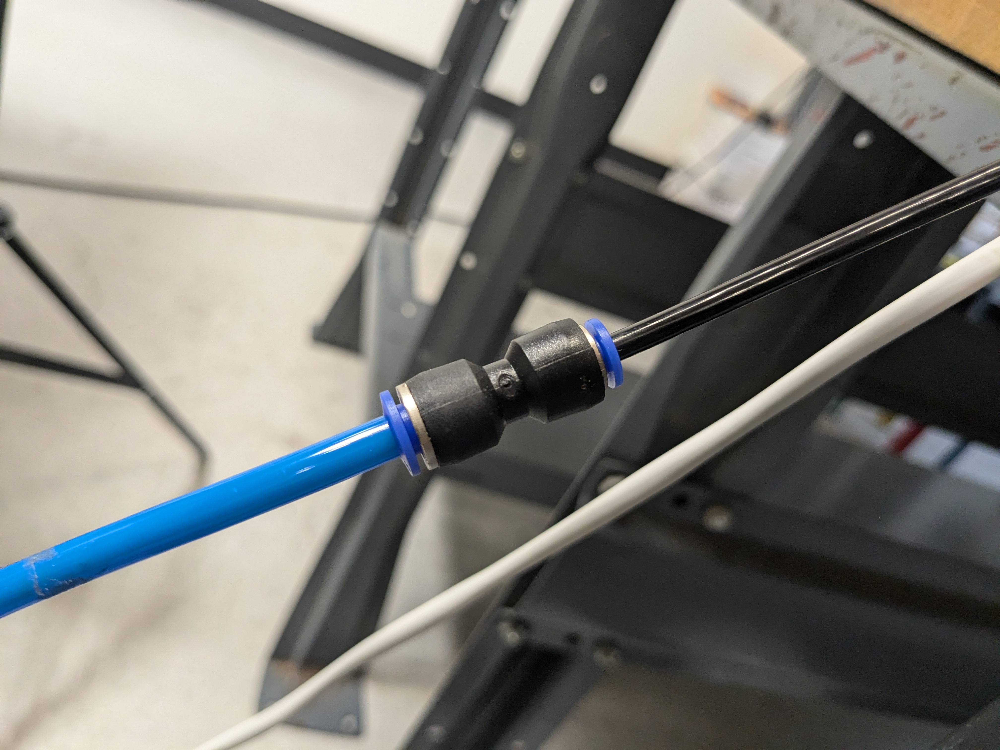
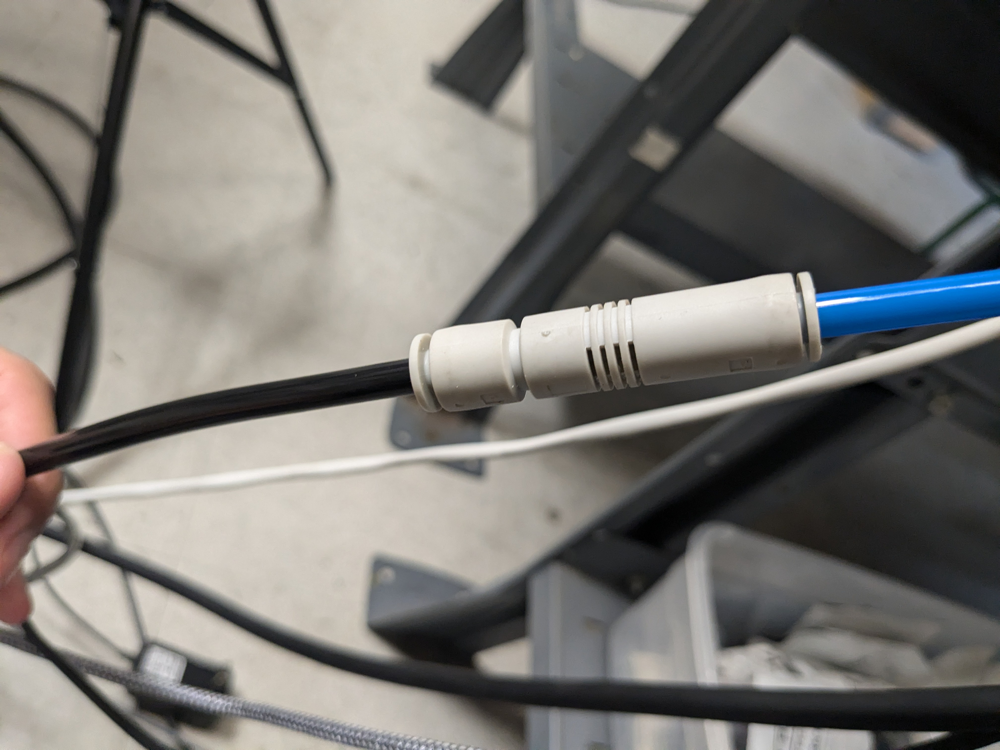

# **Attach Suction Gripper**

## **Overview**
This guide provides instructions for installing the suction gripper on the Dorna TA robotic arm.

## **Parts**

| **Part** | **Description/Image** |
|---|---|
| [Suction gripper kit](https://dorna.ai/grippers/suction-gripper-kit/) |   |

## **Assembly**

##**Pneuatic Instructions**
To start, use a 1/4 in. tube to connect the 0 pneumatic port on the bottom of the robot to the 1/4 in. to 1/2 in. coupler.
  
  
  Next, run the 1/2 in. tube to the pressure-to-vacuum adapter.
  
  Finally, run a 1/4 in. tube from the vacuum adapter to the A port of the solenoid, ensuring the B port is plugged.
  
 
