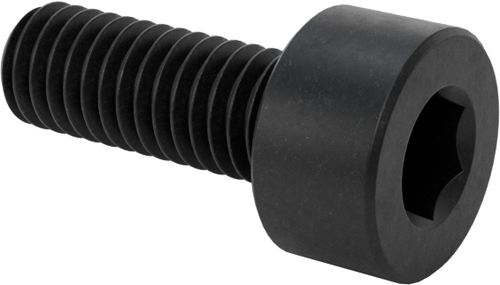

# **Chip Sorting**

## **Overview**
This guide provides step-by-step instructions for using the Dorna TA robotic arm and the basic 3d vision system to detect chips and place them into designated spots.

## **Parts**
| **Part** | **Description/Image** |
|---|---|
| [Robot mounting parts](https://github.com/dorna-robotics/education/blob/main/mount_robot/README.md#parts) |   |
| [Suction gripper mounting parts](https://github.com/dorna-robotics/education/tree/main/attach_suction_gripper#parts) |   |
| [1 x Chip holder/board](https://github.com/dorna-robotics/education/blob/main/basic_object_detection/Assets/GamePieceHolder%20v9.stl) |  |
| [1 x Set of chips](https://github.com/dorna-robotics/education/blob/main/basic_object_detection/Assets/Chips%20v4.stl) |  |
| [3 x M3 8mm screws](https://www.mcmaster.com/91290A113/) |   |

## **Assembly instructions**

1. **Mount the robot**  
   Follow the instructions to mount the robot as described [here](https://github.com/dorna-robotics/education/blob/main/mount_robot/README.md#assembly).
   
3. **Attach the suction gripper**  
   Follow the instructions to attach the suction gripper as described [here](https://github.com/dorna-robotics/education/tree/main/attach_suction_gripper#assembly).  

4. **Attach the chip holder/board**  
   Secure the chip holder/board to the holes in positions ``A7``, ``C7``, and ``E7`` using 3 M3 8mm screws.  
   

5. **Place the chips**  
   Arrange the chips in the chip holder/board area.  
   

6. **Complete the assembly**  
   Your assembly is now complete!  
   

## **Wiring Instructions**
1. [Robot Wiring](https://github.com/dorna-robotics/education/tree/main/mount_robot)

## **Code**

