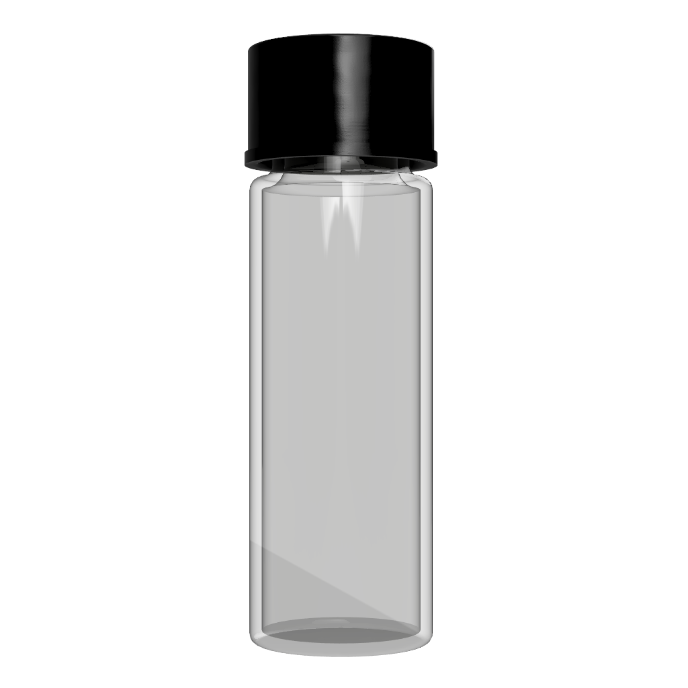
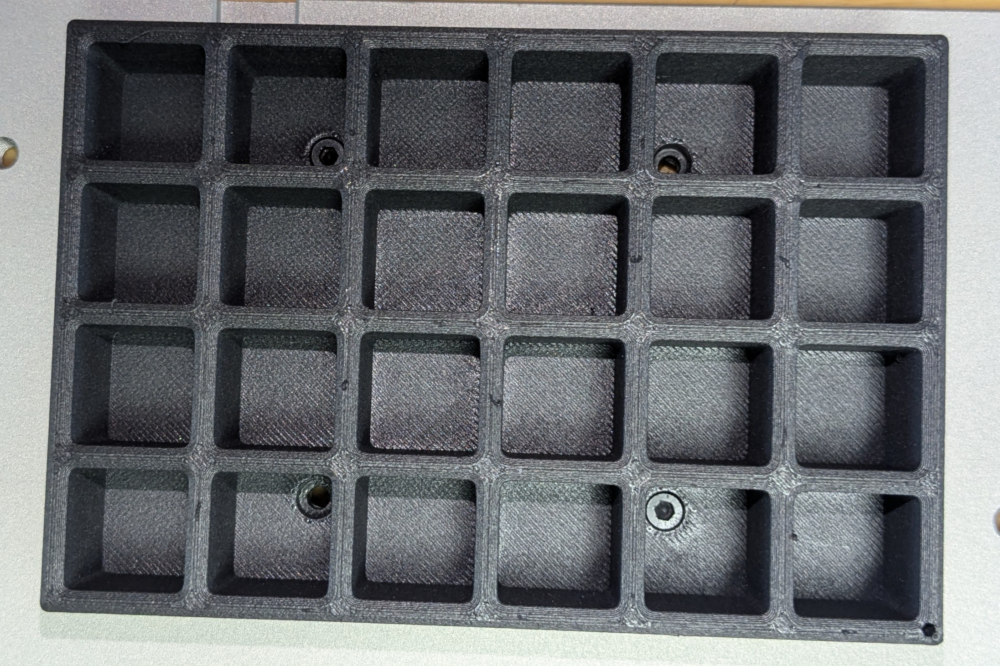
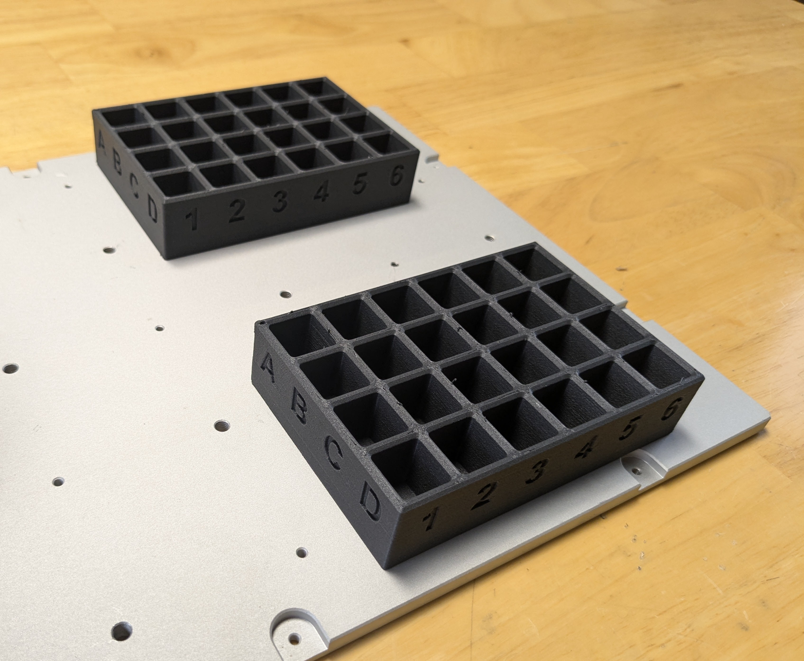

# **Lab Automation**

## **Overview**
In this project, the goal is to automate the transfer of a lab vial from one holder to another using a single Dorna TA robotic arm. This project demonstrates how robotics can be employed in laboratory automation to enhance efficiency and accuracy in handling delicate lab equipment. By using the Dorna TA robot, participants will learn about robotic manipulation, programming, and real-time control in a lab environment.

Students will set up the robotic arm to grasp a vial from one holder and accurately place it into another holder. This process involves calibrating the robot, programming its movements, and ensuring precise vial handling to avoid spills or breakages. The project also includes writing Python scripts to control the robot's actions, handling errors, and managing the transfer process seamlessly.

### **Main Learning Objective: Robotic Manipulation and Automation**
The primary learning objective of this project is to understand and apply robotic manipulation techniques for automating tasks in a real world setting. This involves learning how to program the robot to perform specific tasks, such as picking up and placing vials, and ensuring that these tasks are carried out with high precision. In this project, the Dorna TA robot is used to automate the transfer of vials between holders.

**How We Achieve This**

*    Calibration: The robot needs to be calibrated to understand the exact positions of the vial holders and the vials themselves. This ensures accurate placement and retrieval. The script calculates the positions of the vial holders relative to the robot's base. From 3 Positions It measures distances and uses these measurements to determine the exact locations for picking and placing vials.
*    Movement: Python scripts are written to control the robot's movements. The script calculates the vial holder positions, sends commands to the robot to pick up a vial, move it to the target holder, and release it.

## **Parts**
| **Part** | **Description/Image** |
|---|---|
| [Robot mounting parts](https://github.com/dorna-robotics/education/blob/main/mount_robot/README.md#parts) |   |
| [Gripper mounting parts](https://github.com/dorna-robotics/education/blob/main/attach_two_finger_pneumatic_gripper/README.md#parts) |   |
| [2 x Lab vial holders](https://github.com/dorna-robotics/education/blob/main/lab_automation/Asset/Vial%20Holder%20v10.stl) |  |
| [Lab vials](https://www.amazon.com/dp/B0C8CVQK46?ref=cm_sw_r_cp_ud_dp_GB0VGHMMAQMXRGTBVY2K&ref_=cm_sw_r_cp_ud_dp_GB0VGHMMAQMXRGTBVY2K&social_share=cm_sw_r_cp_ud_dp_GB0VGHMMAQMXRGTBVY2K&skipTwisterOG=2&th=1) |  |
| [1 x Set of pneumatic gripper fingers](https://github.com/dorna-robotics/education/blob/main/lab_automation/Asset/Gripper%20Finger%20v27.stl) |  |
| [8 x M3 8mm screws](https://www.mcmaster.com/91290A113/) |   | 
## **Assembly instructions**

1. **Mount the robot**  
   Follow the [robot mounting instructions](https://github.com/dorna-robotics/education/blob/main/mount_robot/README.md#assembly).

2. **Mount the gripper**  
   Follow the [gripper mounting instructions](https://github.com/dorna-robotics/education/blob/main/attach_two_finger_pneumatic_gripper/README.md#assembly).

3. **Attach the pneumatic gripper fingers**  
   Secure the gripper fingers to the gripper using 4 M3 8mm screws.  
   

4. **Attach the lab vial holders**  
   Fix the lab vial holders to the base plate at the positions ``A8``, ``B9``, ``D8``, and ``E9``.  
     
   

5. **Complete the assembly**  
   Your assembly is complete!  
   

## **Code**
To run the code, use the [.ipynb file](https://github.com/dorna-robotics/education/blob/main/lab_automation/lab_vial.ipynb) in this folder. This section explains how the code works:

1. The code first determines the positions of all lab vial holder cells relative to the robot. It measures the distances between ``A1`` and ``D1``, as well as ``A1`` and ``A6``. Use these measurements to calculate the positions of all cells.

2. The user is then prompted to input the holder cell from which they want to pick a vial and the cell where they want to place it.

3. Next, it validates the inputs and converts the positions to Cartesian coordinates for the robot to use.
   
5. Finally, it uses the Dorna pick and place function to complete the motion.

## **Wiring Instructions**
1. [Robot Wiring](https://github.com/dorna-robotics/education/tree/main/mount_robot)
